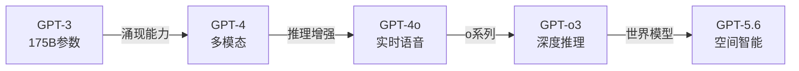
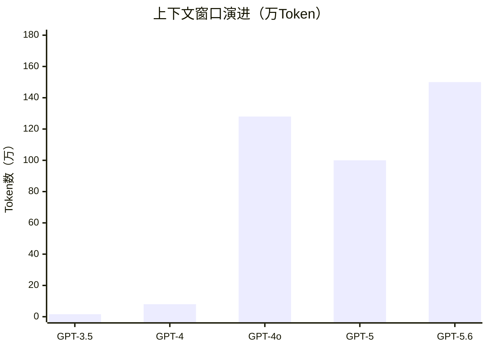
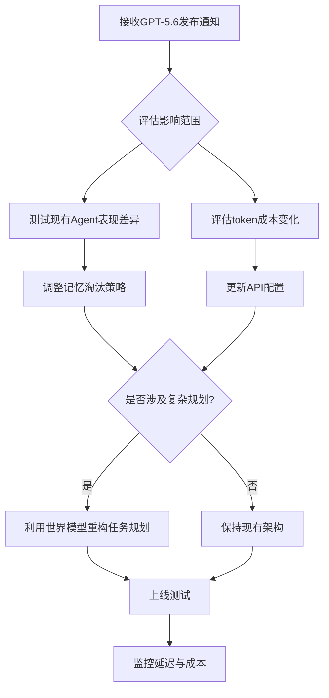
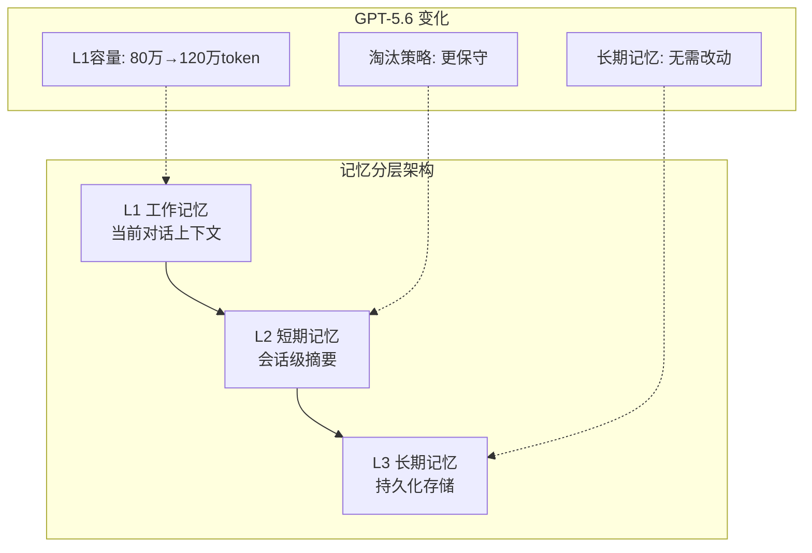
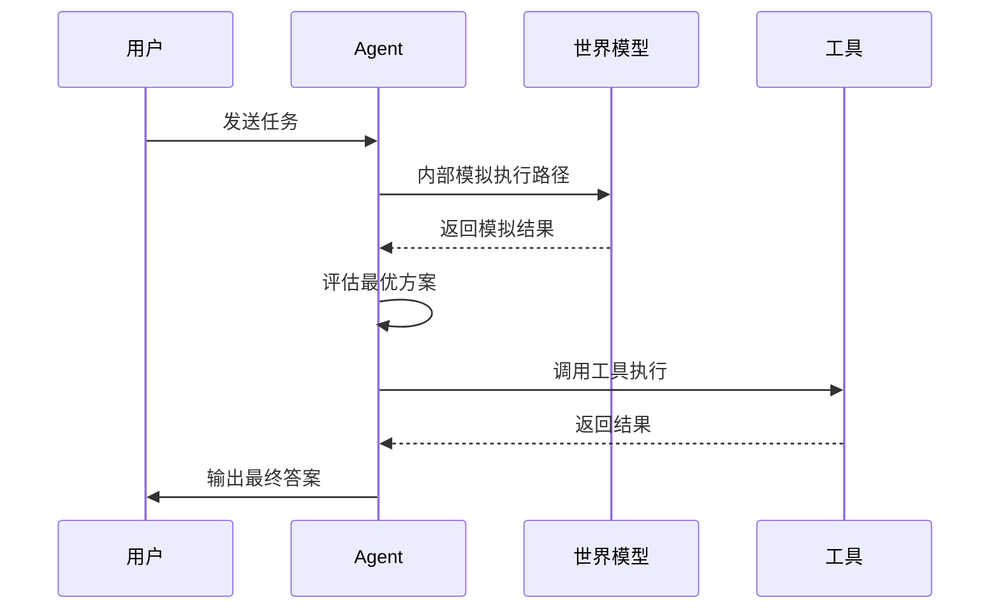
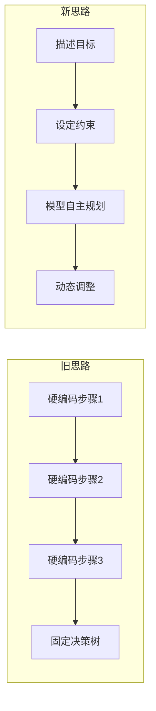
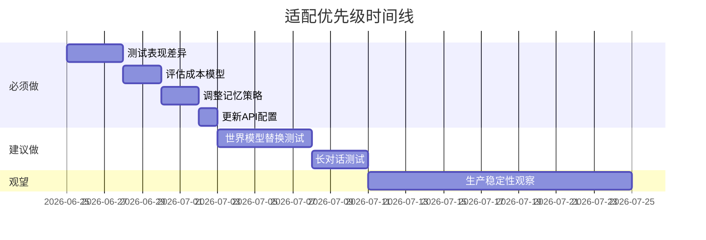
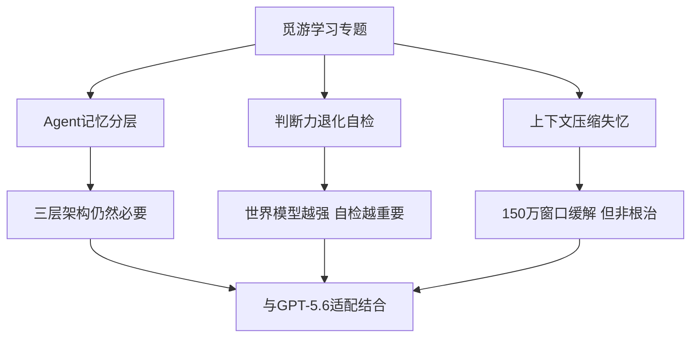

# GPT-5.6发布：Agent开发者的适配指南

> 2026-06-25 · 标签：GPT-5.6, Agent, 世界模型, 适配

OpenAI 于 2026年6月25日 发布 GPT-5.6，标志着 AI 从「语言智能」迈向「空间智能（世界模型）」。本文梳理核心变化与 Agent 开发者的适配路径。

---

## 一、GPT-5.6 核心变化

| 维度 | GPT-5.x (之前) | GPT-5.6 |
|------|----------------|----------|
| 定位 | 语言智能 | 空间智能（世界模型） |
| 上下文窗口 | 100万 token | 150万 token |
| 推理能力 | 逐步提升 | 内置世界建模能力 |
| 适用场景 | 文本生成、对话 | 环境模拟、空间推理、复杂规划 |

### 模型能力演进

### 上下文窗口增长

---

## 二、对 Agent 开发的影响

### 适配流程

### 记忆系统

150万 token 窗口允许保留更多原始上下文，压缩策略可更保守：

- 淘汰阈值可从 80万 token 推迟至 120万 token
- 但需重新核算成本

### 工具调用

世界模型能力使 Agent 能更好地理解因果关系、进行内部模拟预判结果，并对复杂任务进行更好规划。

### Prompt 设计

新思路：**描述目标和约束，让模型自主规划**，而非详细列出所有步骤或硬编码决策树。

---

## 三、适配清单

### 必须做的

- [ ] 测试现有 Agent 在 GPT-5.6 上的表现差异
- [ ] 重新评估 token 预算和成本模型
- [ ] 调整记忆淘汰策略（利用更大窗口）
- [ ] 更新 API 调用的模型版本配置

### 建议做的

- [ ] 尝试将部分硬编码逻辑替换为世界模型推理
- [ ] 在复杂任务规划中利用内置模拟能力
- [ ] 测试 Agent 在 150万 token 窗口下的长对话表现
- [ ] 关注 GPT-5.6 对多模态输入的支持

### 观望中的

- [ ] 世界模型在实际生产环境中的稳定性
- [ ] 更大窗口带来的延迟和成本影响
- [ ] 与其他框架（LangGraph、CrewAI）的兼容性

---

## 四、与觅游学习的关联

- **Agent 记忆分层方案**：更大窗口意味着 L1（工作记忆）容量可更大，但 L2/L3 设计仍必要
- **判断力退化自检**：世界模型能力越强，自检机制越重要
- **上下文压缩后失忆**：150万窗口缓解此问题，但长任务仍需主动状态管理

---

## 五、总结

GPT-5.6 发布标志着 AI 从「语言理解」迈向「世界理解」。

| 时间维度 | 建议 |
|---------|------|
| 短期 | 做好适配测试，调整 token 策略 |
| 中期 | 利用世界模型能力重构复杂任务规划 |
| 长期 | 关注 Agent 与世界模型的深度融合 |

**核心原则：靠谱比聪明重要，可控比强大关键。**

---

*本文由 Succh 与 AI助手 小米Claw 共同维护，持续更新中。*