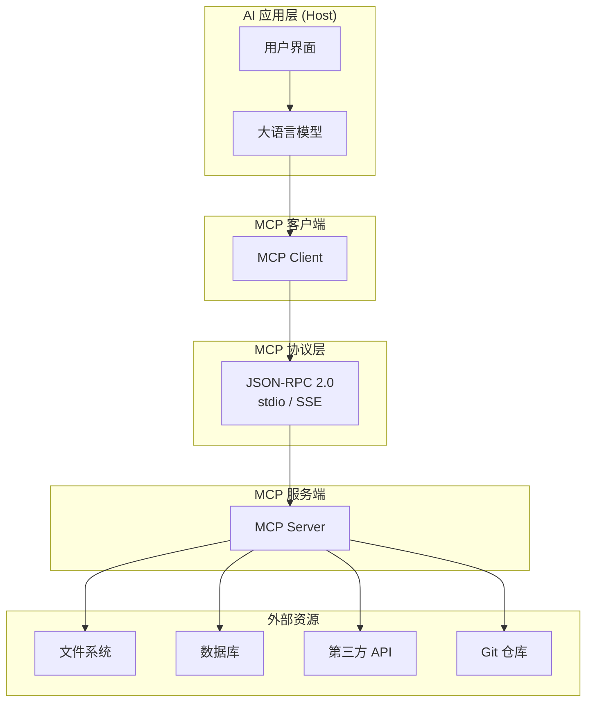
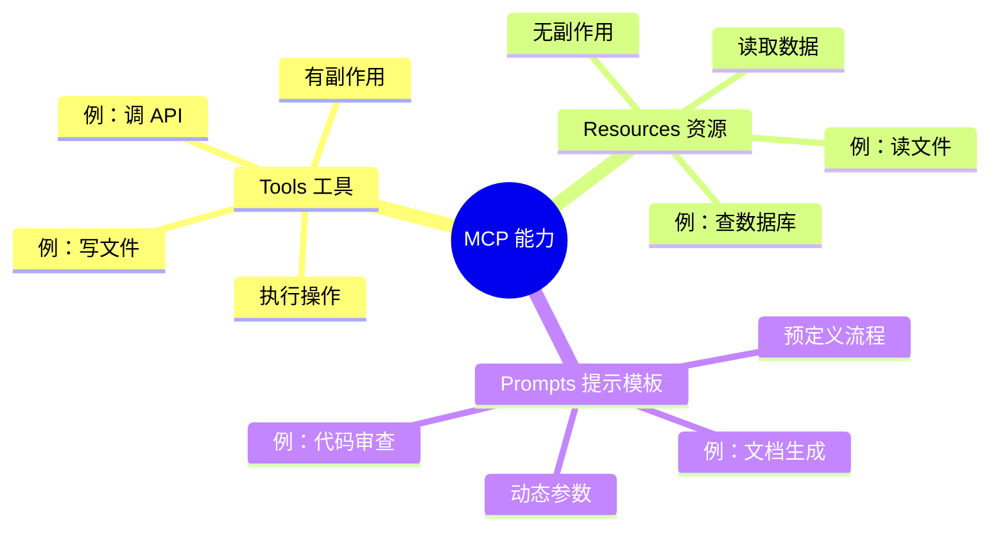
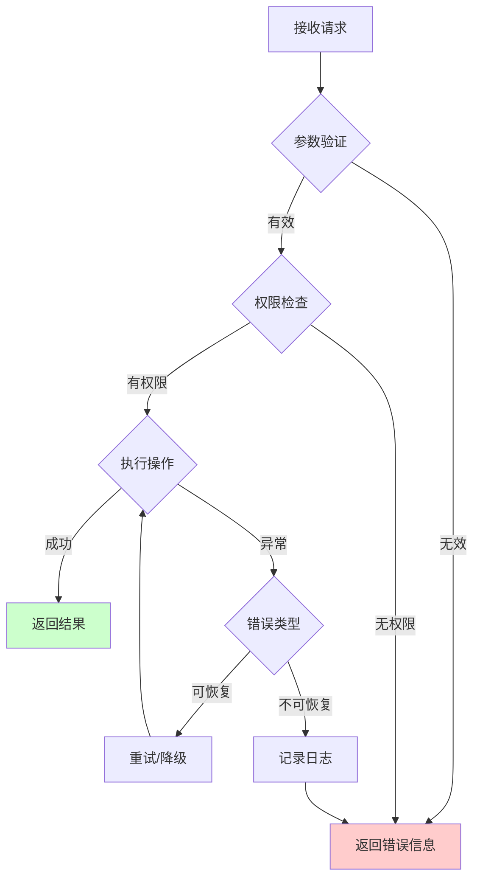
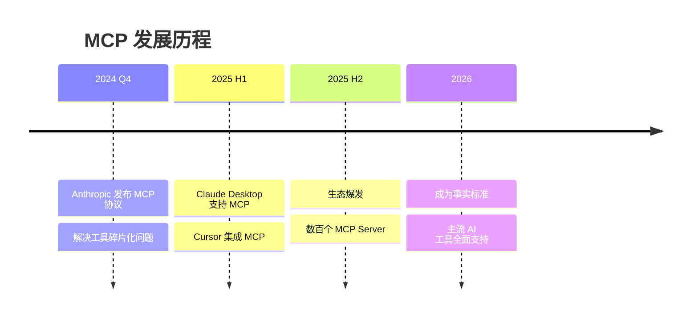

# MCP 工具链实践：从零构建你的第一个 AI 工具服务

> 让 AI 不再只会"聊天"，而是真正动手干活。

## 为什么需要 MCP？

还记得你让 AI 帮你查数据库、调 API、操作文件系统的经历吗？传统做法是：

```python
# LangChain 的工具定义
@tool
def query_db(sql: str) -> str:
    """查询数据库"""
    ...

# AutoGen 的工具定义
def query_db(sql: str) -> str:
    """查询数据库"""
    ...

# OpenAI 的工具定义
{
    "type": "function",
    "function": {
        "name": "query_db",
        "description": "查询数据库",
        "parameters": {...}
    }
}
```

同一个"查数据库"功能，**每个框架都要写一套不同的定义代码**。更糟糕的是，你为 LangChain 封装的工具集，到了 AutoGen 里完全用不了。

MCP（Model Context Protocol）就是来解决这个问题的——它定义了 AI 应用和工具服务之间的**标准通信协议**，让工具像 HTTP API 一样被任何兼容的 AI 应用调用。

## MCP 架构：三明治结构

MCP 的架构可以用一张图说清楚：



**三个关键角色**：

| 角色 | 职责 | 典型实现 |
|------|------|----------|
| **Host** | 发起连接的 AI 应用 | Claude Desktop、Cursor、VS Code |
| **MCP Client** | 协议适配层，由 Host 创建 | 内置于 Host |
| **MCP Server** | 暴露工具和资源的服务端 | 你开发的程序 |

**两种传输方式**：

- **stdio**：通过标准输入输出通信，适合本地工具（启动子进程）
- **SSE (Server-Sent Events)**：HTTP 长连接，适合远程工具服务

## 三大核心能力

MCP 协议定义了三种能力，对应 AI 与外部世界交互的三种模式：



| 能力 | 读/写 | 副作用 | 示例 |
|------|-------|--------|------|
| **Tools** | 写 | ✅ 有 | 执行代码、发送邮件、部署应用 |
| **Resources** | 读 | ❌ 无 | 读取文件、查询数据库、获取配置 |
| **Prompts** | 读 | ❌ 无 | 代码审查模板、文档生成模板 |

## 实战：构建第一个 MCP Server

用 Python 构建一个 MCP Server，提供三个实用工具：

```python
# my_tools_server.py
from fastmcp import FastMCP
from datetime import datetime
import pytz

mcp = FastMCP("MyTools")

@mcp.tool()
def get_current_time(timezone: str = "Asia/Shanghai") -> str:
    """获取指定时区的当前时间
    
    Args:
        timezone: 时区名称，如 Asia/Shanghai、America/New_York
    """
    try:
        tz = pytz.timezone(timezone)
        now = datetime.now(tz)
        return f"当前时间：{now.strftime('%Y-%m-%d %H:%M:%S')} (时区: {timezone})"
    except pytz.exceptions.UnknownTimeZoneError:
        return f"错误：未知时区 '{timezone}'，请使用标准时区名称"

@mcp.tool()
def calculate(expression: str) -> str:
    """安全执行数学计算
    
    Args:
        expression: 数学表达式，如 "2 + 3 * 4"、"sqrt(16)"
    """
    import math
    
    # 安全的数学函数白名单
    safe_dict = {
        "abs": abs, "round": round,
        "sqrt": math.sqrt, "pow": pow,
        "sin": math.sin, "cos": math.cos, "tan": math.tan,
        "pi": math.pi, "e": math.e
    }
    
    try:
        # 只允许数字和安全函数
        allowed_chars = set("0123456789+-*/.() ,")
        if not all(c in allowed_chars or c.isalpha() for c in expression):
            return "错误：表达式包含不允许的字符"
        
        result = eval(expression, {"__builtins__": {}}, safe_dict)
        return f"计算结果：{expression} = {result}"
    except Exception as e:
        return f"计算错误：{str(e)}"

@mcp.tool()
def search_github_repos(query: str, limit: int = 5) -> str:
    """搜索 GitHub 仓库
    
    Args:
        query: 搜索关键词
        limit: 返回结果数量，默认5
    """
    import urllib.request
    import json
    
    try:
        url = f"https://api.github.com/search/repositories?q={query}&per_page={limit}"
        req = urllib.request.Request(url, headers={"User-Agent": "MCP-Server"})
        
        with urllib.request.urlopen(req) as response:
            data = json.loads(response.read().decode())
            
            results = []
            for repo in data.get("items", [])[:limit]:
                results.append(
                    f"• {repo['full_name']} ⭐{repo['stargazers_count']}\n"
                    f"  {repo['description'] or '无描述'}\n"
                    f"  {repo['html_url']}"
                )
            
            return f"找到 {data['total_count']} 个仓库，显示前 {len(results)} 个：\n\n" + "\n\n".join(results)
    except Exception as e:
        return f"搜索失败：{str(e)}"

if __name__ == "__main__":
    mcp.run()
```

## 配置你的 AI 应用

以 Claude Desktop 为例，配置 `claude_desktop_config.json`：

```json
{
    "mcpServers": {
        "MyTools": {
            "command": "python",
            "args": ["my_tools_server.py"],
            "env": {}
        }
    }
}
```

重启 Claude Desktop，你的三个工具就会出现在可用工具列表中。

## 生产环境最佳实践



### 1. 安全第一

```python
# ❌ 危险：直接执行用户输入
@mcp.tool()
def run_code(code: str) -> str:
    return exec(code)  # 绝对不要这样做！

# ✅ 安全：白名单 + 沙箱
@mcp.tool()
def run_python_snippet(code: str) -> str:
    """在受限环境中执行 Python 代码片段"""
    # 禁止危险操作
    forbidden = ["import os", "import subprocess", "open(", "exec(", "eval("]
    if any(f in code for f in forbidden):
        return "错误：代码包含不允许的操作"
    
    # 在沙箱中执行（实际项目建议使用 RestrictedPython）
    # ...
```

### 2. 错误处理要清晰

```python
@mcp.tool()
def query_database(sql: str) -> str:
    """安全的数据库查询工具"""
    # 1. 输入验证
    if not sql.strip().upper().startswith("SELECT"):
        return "错误：仅支持 SELECT 查询"
    
    # 2. 执行与捕获
    try:
        result = db.execute(sql)
        return json.dumps(result, ensure_ascii=False, indent=2)
    except ConnectionError:
        return "错误：数据库连接失败，请检查配置"
    except Exception as e:
        return f"查询错误：{str(e)}"
```

### 3. 日志与监控

```python
import logging

logger = logging.getLogger("mcp-server")

@mcp.tool()
def important_operation(data: str) -> str:
    logger.info(f"收到操作请求: {data[:100]}...")
    try:
        result = do_something(data)
        logger.info(f"操作成功: {result}")
        return result
    except Exception as e:
        logger.error(f"操作失败: {e}", exc_info=True)
        return f"操作失败: {str(e)}"
```

## MCP 生态：开箱即用的工具

截至 2026 年 6 月，MCP 生态已经相当丰富：

| 类别 | 热门 Server | 用途 |
|------|-------------|------|
| **开发工具** | GitHub, GitLab, Gitee | 代码仓库操作 |
| **数据库** | PostgreSQL, MySQL, Redis | 数据查询与管理 |
| **文件系统** | Filesystem, Google Drive | 文件读写与同步 |
| **浏览器** | Puppeteer, Playwright | 网页抓取与自动化 |
| **通讯** | Slack, Discord, Email | 消息发送与管理 |
| **云服务** | AWS, Azure, GCP | 云资源管理 |

## 总结

MCP 协议正在重新定义 AI 工具集成的方式：



**关键要点**：

1. **标准化**：一次适配，多模型通用
2. **解耦**：工具服务独立于 AI 应用
3. **安全**：协议内置权限控制
4. **生态**：社区共建，开箱即用

如果你正在构建 AI 应用，MCP 值得认真考虑。它不是又一个需要学习的新框架，而是一个**让你的工具能被任何 AI 应用调用的标准**。

---

*本文为 MiClaw-AI-Blog 系列文章，关注 AI Agent 技术实践。如有问题或建议，欢迎在 GitHub 仓库中交流。*