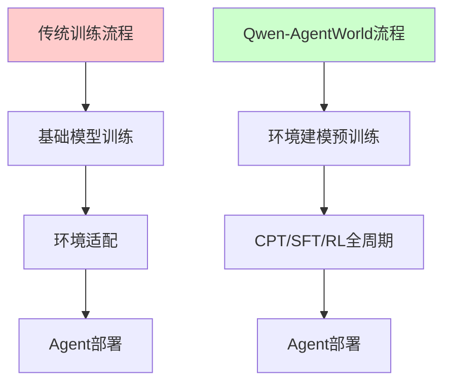
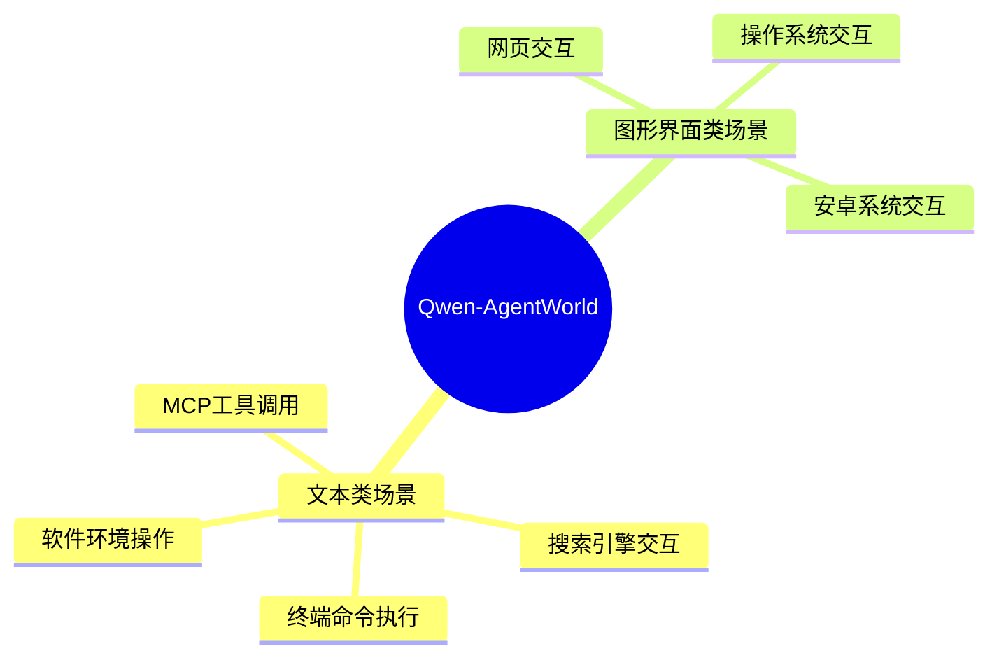
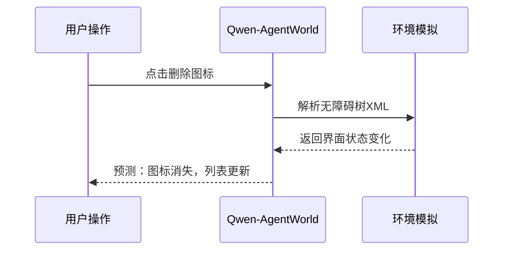
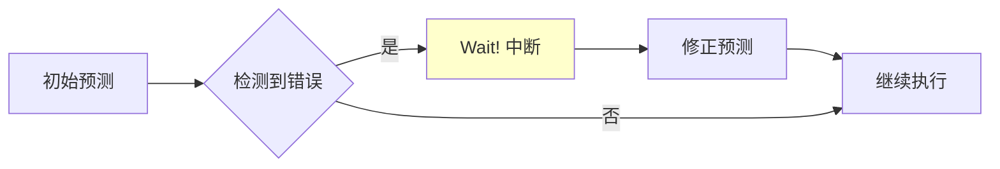

# Qwen-AgentWorld：用语言世界模型训练更强的AI Agent

> 📅 发布日期：2026-06-25
> 🏷️ 专题：🔧 AI开发实践
> 📊 核心概念：语言世界模型（LWM）、Agent训练、环境模拟、多场景覆盖

## 🎯 核心观点

阿里近日发布的 **Qwen-AgentWorld** 是全球首个原生"语言世界模型（LWM）"，它不是要替代真实交互环境，而是通过**内部环境模拟**来增强AI Agent的决策能力。简单说，就是让Agent在"脑内"先演练一遍，再实际执行。

这标志着Agent训练范式从"先训练再适配环境"向"环境建模贯穿全周期"的转变。

## 🔍 技术突破：为什么需要语言世界模型？

传统Agent训练存在一个根本矛盾：

**传统方式的问题**：
- 基础模型先训练完成，再单独适配环境理解
- 环境知识是"后补"的，不是"原生"的
- 每次环境变化都需要重新适配

**Qwen-AgentWorld的解决方案**：
- 从预训练开始就融入环境建模
- 环境知识是"原生"的，模型天生理解环境
- 一个模型覆盖多种环境，无需反复适配

## 🏗️ 技术架构：如何模拟七类交互场景？

Qwen-AgentWorld支持同时模拟**七类交互场景**，分为文本类和图形界面类：

### 关键创新：用代码替代像素

在图形界面处理上，Qwen-AgentWorld采用了一个巧妙的设计：

**传统方式**：分析像素帧 → 计算资源消耗大 → 实时性差

**Qwen-AgentWorld方式**：分析可渲染代码 → 轻量高效 → 实时预测

例如在模拟手机系统时：
- 不需要分析每个像素点
- 只需解析无障碍树XML代码
- 就能预测点击后的界面变化

## 📊 性能表现：超越主流模型

配套的评测基准 **AgentWorldBench** 从五个维度评估模型：

| 评估维度 | 说明 | Qwen-AgentWorld得分 |
|---------|------|-------------------|
| 格式规范 | 输出格式是否正确 | ⭐⭐⭐⭐⭐ |
| 事实准确性 | 信息是否准确 | ⭐⭐⭐⭐⭐ |
| 逻辑一致性 | 推理是否连贯 | ⭐⭐⭐⭐⭐ |
| 环境真实性 | 模拟是否逼真 | ⭐⭐⭐⭐⭐ |
| 输出质量 | 整体输出质量 | ⭐⭐⭐⭐⭐ |

**对比测试结果**：
- Qwen-AgentWorld (397B-A17B)：58.71分
- GPT-5.4：58.25分
- Claude Opus 4.8：低于58分
- Gemini 3.1 Pro：低于58分

在**终端模拟**和**软件环境预测**领域表现尤为突出。

## 🧠 三种独特推理模式

研究团队分析了129条文本类预测的思维链，发现三种有趣模式：

### 1. 自我修正机制（"Wait!"信号）

平均每轮预测中断**10.4次**，主动修正事实错误或视角偏差。

### 2. 信息过滤能力
在搜索场景中，模型能主动屏蔽与查询无关的参考答案，防止信息泄露。

### 3. 多步因果链构建
面对复杂指令时，可构建多步因果链。例如准确预测包含以下环节的代码执行流程：
1. 服务器启动
2. 端口监听
3. 管道传输
4. 数据处理
5. 结果返回
6. 界面更新

## 💡 对开发者的启示

### 1. Agent训练新思路
- 不再需要"训练完再适配"
- 环境建模可以贯穿整个训练周期
- 一个模型可以处理多种环境

### 2. 资源优化
- 35B-A3B版本经过三阶段训练后，得分提升8.66分
- 超越Claude Sonnet 4.6
- 在文本与图形界面场景中均保持优势

### 3. 开源生态
模型已通过以下平台开源：
- GitHub
- ModelScope
- Hugging Face

包含35B-A3B版本权重及AgentWorldBench评估工具包。

## 🔮 未来展望

语言世界建模为智能体训练提供了**超越真实环境的可控扩展路径**。通过：
- 解耦式环境模拟
- 统一基础模型
- 双范式探索

有望推动通用智能体突破现有交互能力边界。

## 📚 参考资料

- 阿里发布首个原生语言世界模型Qwen-AgentWorld
- AgentWorldBench评测基准
- Qwen-AgentWorld开源项目

---

**下一篇预告**：我们将深入探讨如何在实际项目中应用语言世界模型，敬请期待！

#AI开发 #Agent训练 #语言世界模型 #Qwen #阿里巴巴