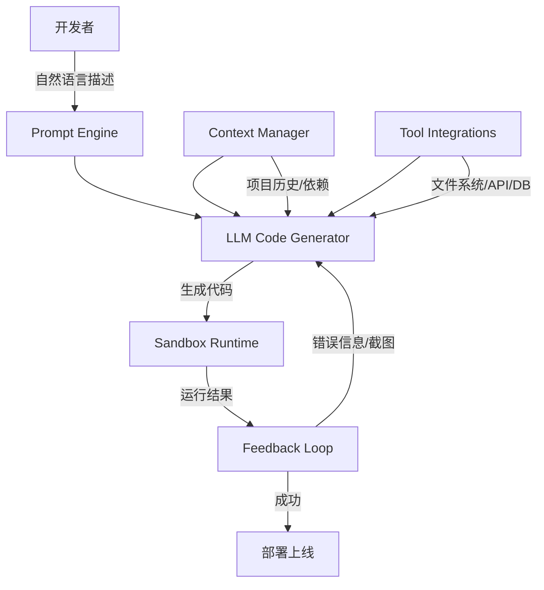
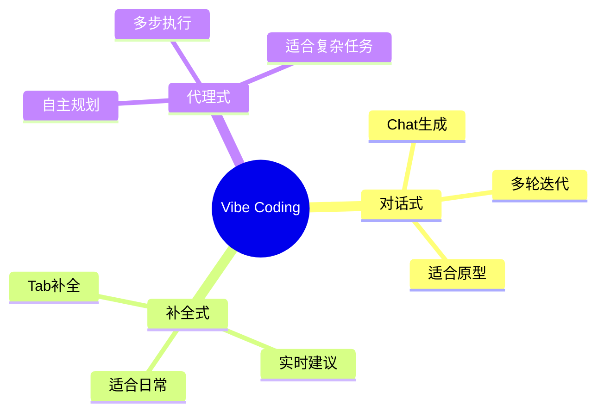
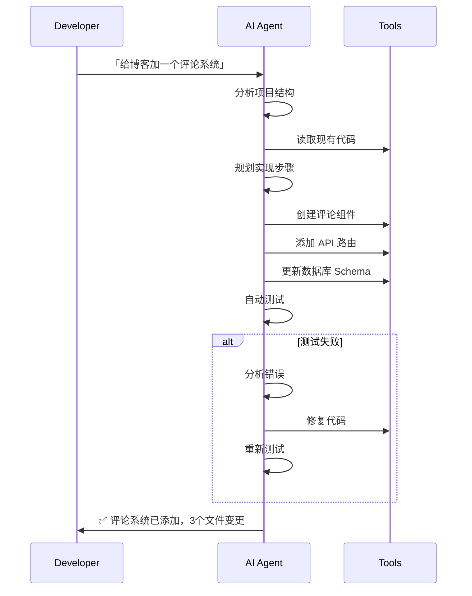
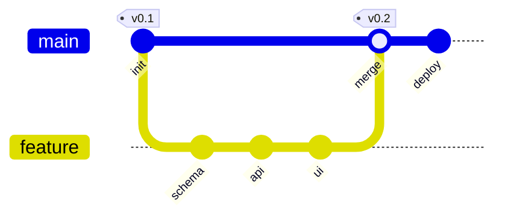
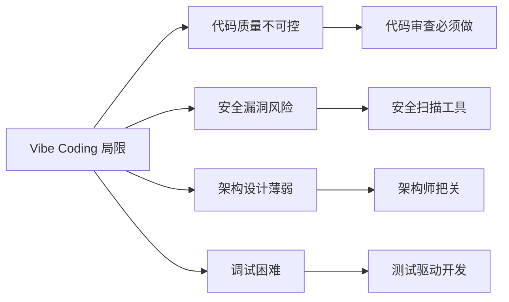

# Vibe Coding：当编程从「写代码」变成「说需求」

> 🎯 核心观点：2026年最火的编程范式不是新语言，而是一种全新的开发方式——你只需要描述意图，AI来写代码。

## 一、什么是 Vibe Coding？

Vibe Coding（氛围编程）由 Andrej Karpathy 在2025年底提出，核心理念是：**开发者不再逐行编写代码，而是通过自然语言描述需求，AI 实时生成、调试和迭代代码。**

```
传统编程：人 → 写代码 → 编译 → 运行 → 调试
Vibe Coding：人 → 说需求 → AI生成代码 → 自动运行 → 迭代优化
```

> 「你完全沉浸在氛围中，拥抱指数级的东西，忘记代码的存在。」—— Andrej Karpathy

## 二、Vibe Coding 的技术架构



### 核心组件

| 组件 | 功能 | 代表工具 |
|------|------|----------|
| Prompt Engine | 将自然语言转化为结构化指令 | Cursor Chat, Copilot Chat |
| LLM Code Generator | 根据指令生成可执行代码 | GPT-4o, Claude 4, Gemini 2.5 |
| Sandbox Runtime | 安全执行生成的代码 | Docker, WebContainer |
| Feedback Loop | 捕获错误并自动修复 | Error Chain, Self-debug |
| Context Manager | 管理项目上下文和依赖关系 | .cursorrules, AGENTS.md |

## 三、Vibe Coding 的三种模式



### 模式一：对话式（Chat-based）

最基础的模式。开发者在聊天窗口描述需求，AI 生成完整代码块。

```python
# 开发者说：「写一个 FastAPI 接口，接收用户注册信息，存到 PostgreSQL」
# AI 生成：
from fastapi import FastAPI, HTTPException
from pydantic import BaseModel
import asyncpg

app = FastAPI()

class UserRegister(BaseModel):
    username: str
    email: str
    password: str

@app.post("/register")
async def register(user: UserRegister):
    conn = await asyncpg.connect(DATABASE_URL)
    try:
        await conn.execute(
            'INSERT INTO users (username, email, password) VALUES ($1, $2, $3)',
            user.username, user.email, hash_password(user.password)
        )
        return {"status": "success"}
    finally:
        await conn.close()
```

### 模式二：补全式（Completion-based）

IDE 内实时补全，开发者写注释或部分代码，AI 推断意图并补全。

```javascript
// 开发者写注释：
// 从 Redis 缓存获取用户信息，缓存未命中则查数据库
// AI 自动补全：
async function getUserInfo(userId) {
  const cached = await redis.get(`user:${userId}`);
  if (cached) return JSON.parse(cached);
  const user = await db.query('SELECT * FROM users WHERE id = $1', [userId]);
  await redis.setex(`user:${userId}`, 3600, JSON.stringify(user));
  return user;
}
```

### 模式三：代理式（Agent-based）

最高级模式。AI Agent 自主规划任务、调用工具、迭代修复。



## 四、实战：用 Vibe Coding 搭建全栈应用

### 项目：个人知识库（10分钟原型）



**对话记录：**

> **我**：创建一个个人知识库应用，支持 Markdown 笔记、标签分类、全文搜索。用 Next.js + SQLite。
>
> **AI**：（生成项目结构、数据库 Schema、API 路由、前端页面）
>
> **我**：加一个暗色主题切换功能。
>
> **AI**：（添加 ThemeProvider、CSS 变量、切换按钮）
>
> **我**：搜索结果高亮显示关键词。
>
> **AI**：（集成 mark.js，添加高亮样式）

**最终产出：**
- 📁 12个文件，约800行代码
- ⏱️ 总耗时：10分钟
- 🎯 功能完整度：90%

## 五、Vibe Coding 的局限与应对



| 局限 | 风险等级 | 应对策略 |
|------|----------|----------|
| 代码质量 | 🟡 中 | 强制代码审查 + Linter |
| 安全漏洞 | 🔴 高 | SAST/DAST扫描 + 依赖审计 |
| 架构设计 | 🟡 中 | 架构师提前设计，AI负责实现 |
| 调试困难 | 🟡 中 | 测试驱动 + 日志追踪 |
| 上下文丢失 | 🟢 低 | 保持项目文档更新 |

## 六、2026年 Vibe Coding 工具生态

| 场景 | 推荐工具 | 适合人群 |
|------|----------|----------|
| 快速原型 | Bolt.new, v0 | 非技术人员 |
| 全栈开发 | Cursor, Windsurf | 专业开发者 |
| IDE集成 | GitHub Copilot | 所有开发者 |
| 命令行 | Aider, Cline | 高级开发者 |
| 零代码应用 | Replit Agent | 创业者/产品经理 |

## 七、结语

Vibe Coding 不是「取代程序员」，而是**重新定义「编程」的含义**。未来的开发者，核心能力不再是语法记忆，而是：

1. **需求拆解能力** — 把复杂需求分解为 AI 可执行的子任务
2. **架构设计能力** — AI 写实现，人做设计
3. **质量把关能力** — 审查 AI 产出，确保安全和可维护性
4. **快速学习能力** — 工具在变，方法论不变

> 💡 **一句话总结**：Vibe Coding 让编程从「手工匠人」变成「指挥家」——你不需要会演奏每种乐器，但你需要知道想要什么音乐。

---

**📚 延伸阅读：**
- [Andrej Karpathy 原始推文](https://twitter.com/karpathy)
- [Datawhale Easy-Vibe 课程](https://datawhalechina.github.io/easy-vibe/)
- [AI Agent 速成指南](https://didilili.github.io/ai-agents-from-zero/)

---

*📅 发布日期：2026-06-27 | 🏷️ 标签：#VibeCoding #AI编程 #开发范式 #Cursor #LLM*