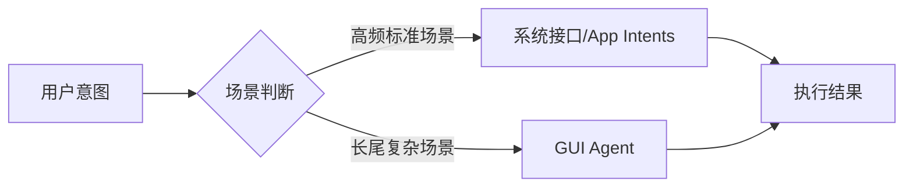

# AI手机进入Agent时代：从语音助手到系统级智能入口

> 📅 2026-06-30 | 🏷️ AI手机、Agent、Siri、GUI Agent、MCP

## 📌 引言

2026年6月底，AI手机赛道密集发声：苹果WWDC26发布新版Siri AI，谷歌推进Gemini Intelligence深度整合Android，OpenAI被曝开发AI手机，豆包与中兴联合推出努比亚M153。全球手机AI助手正从"被动响应的工具"向"主动协助的系统级智能入口"演进。

**核心命题变了**：不是"手机上有没有AI"，而是"AI能不能理解我的场景、替我把事办了"。

---

## 📊 一、四大玩家的战略路径

### 1.1 苹果：系统级深度整合

WWDC26上发布的新版Siri AI，核心升级：

| 能力 | 具体表现 |
|:---|:---|
| **屏幕理解** | 能"看到"用户当前屏幕内容，理解上下文 |
| **跨应用操作** | 在消息、邮件、照片等应用间搜索信息、完成任务 |
| **个人上下文** | 结合用户习惯和历史提供个性化服务 |
| **联网能力** | 可联网获取实时信息补充回答 |

苹果的逻辑：**不单独做一个AI App，而是让AI成为系统的"神经中枢"**。

### 1.2 谷歌：开放生态+第三方场景

谷歌在Android中推进Gemini Intelligence，与三星合作的Galaxy S26将深入第三方应用场景——点外卖、叫车等日常任务。核心思路：**让AI穿透App边界，直接操作用户需要的服务**。

### 1.3 OpenAI：从软件到硬件

据报道，OpenAI正在开发以ChatGPT为核心的AI手机，最快2027年量产。这意味着AI公司开始**反向定义硬件**，而不是在别人的硬件上做适配。

### 1.4 国内厂商：豆包手机助手落地

豆包手机助手与中兴合作推出努比亚M153，能帮助用户完成下单等实际任务。国内厂商的策略：**先落地、先跑量、先积累场景数据**。

---

## 🎯 二、三条技术路径的博弈

让AI"操作手机"，目前有三条主要技术路径：

| 路径 | 原理 | 优势 | 劣势 |
|:---|:---|:---|:---|
| **系统接口** | OS厂商开放API给AI调用 | 稳定、安全、高效 | 依赖厂商开放程度 |
| **App Intents** | 应用主动声明可被AI调用的能力 | 精准、可控 | 需要开发者配合 |
| **GUI Agent** | AI像用户一样"看懂"界面并操作 | 不依赖接口开放，覆盖长尾场景 | 速度慢、稳定性差 |



**未来趋势**：三者融合。高频走系统接口保证速度和稳定性，长尾走GUI Agent保证覆盖面。

---

## 📈 三、竞争逻辑的根本转变

### 3.1 从"参数竞赛"到"任务完成率"

| 维度 | 过去 | 现在 |
|:---|:---|:---|
| **核心指标** | 参数量、跑分 | 任务完成率、成功率 |
| **用户感知** | "能聊天" | "能办事" |
| **技术焦点** | 模型能力 | 场景理解+工具调用 |
| **护城河** | 模型大小 | 生态整合深度 |

### 3.2 交互中心的迁移

手机交互中心正在发生一次根本迁移：

```
App图标 → 搜索框 → AI助手
```

### 3.3 对开发者的启示

- **短期**：你的App需要声明AI可调用的能力（App Intents / MCP接口）
- **中期**：不接入AI生态的App，流量入口可能被AI助手截断
- **长期**：AI助手可能成为新的"应用商店"——用户通过AI发现和使用服务

---

## 🔮 四、冷静看：还有多远？

### 4.1 当前能力边界

| 能力 | 成熟度 | 说明 |
|:---|:---|:---|
| 信息查询与整理 | ⭐⭐⭐⭐ | 已基本可用 |
| 单步操作（发消息/设闹钟） | ⭐⭐⭐⭐ | 主流助手已支持 |
| 多步流程（订餐/打车） | ⭐⭐⭐ | 部分场景可用 |
| 跨应用复杂任务 | ⭐⭐ | 仍在探索中 |
| 长尾场景GUI操作 | ⭐⭐ | 稳定性待提升 |

### 4.2 核心挑战

1. **信任问题**：用户敢不敢让AI帮自己付款、发消息？
2. **隐私问题**：AI需要"看到"屏幕内容才能操作，这意味着所有信息对AI可见
3. **生态碎片化**：不同厂商的Agent标准不统一，跨品牌协作仍是难题

---

## ✅ 总结

- 📌 **趋势确定**：苹果、谷歌、OpenAI、国内厂商同时发力，AI手机Agent化是共识
- 📌 **技术融合**：系统接口 + App Intents + GUI Agent，三条路径互补而非替代
- 📌 **竞争转向**：从"模型参数"转向"任务完成率"，从"能聊天"转向"能办事"
- 📌 **挑战犹存**：信任、隐私、生态碎片化，"能用"到"好用"还需攻坚

> 下一代手机的竞争力，不在于屏幕多大、芯片多快，而在于**AI能不能真正理解你、替你把事办了**。

---

*信息来源：21世纪经济报道、东方财富网、央视新闻，2026年6月29-30日报道。*