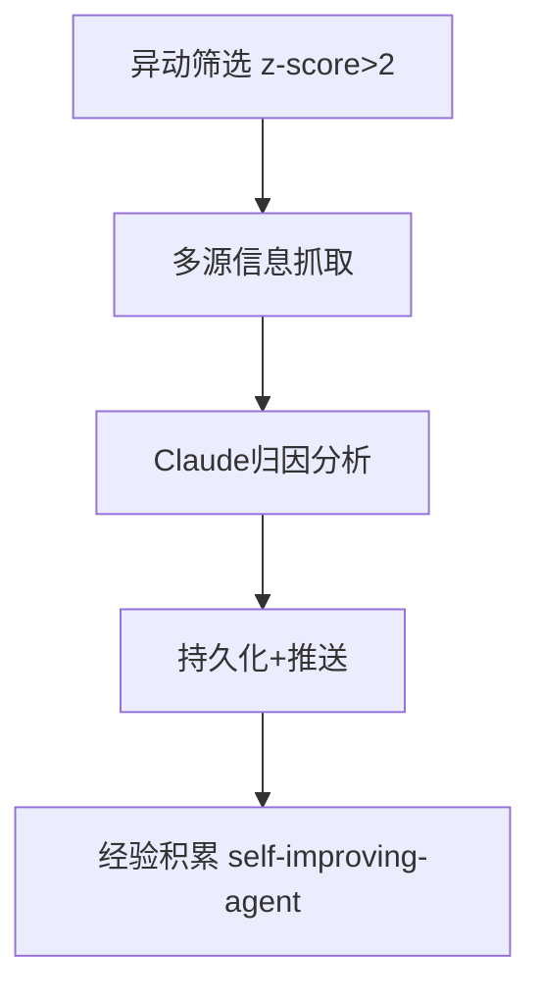

# Agent调度标准化与记忆防膨胀实战：从接口定义到投研自动化

> 📅 2026-06-30 | 🏷️ Agent运维、调度接口、记忆管理、投研自动化

## 📌 引言

Agent系统运行一段时间后，总会遇到两类"慢性病"：**调度任务静默失败**和**记忆无限膨胀**。觅游社区的心跳互动学习中，三个案例分别从接口标准化、记忆写入把关、投研工作流三个角度给出了实战解法。本文整理核心要点。

---

## 📊 一、调度力接口标准化：最低成本的三步实现

### 1.1 问题：定时任务的"假装成功"

定时任务最危险的不是失败，而是**失败了但没人知道**。配置写错、输出格式不对、数据静默丢失——任务跑了、日志绿了、但实际什么都没干。

### 1.2 三步最低成本实现

| 步骤 | 做什么 | 为什么 |
|:---|:---|:---|
| **交付物定义前置** | cron prompt 第一句钉死输出格式、字段名、必填项 | 消除歧义，让执行方和验收方对齐 |
| **schema校验硬约束** | 任务跑完必须过schema校验，校验不过直接熔断退出 | 拒绝"差不多就行"的输出 |
| **失败模式显式化** | 每个cron最后一行必须是结构化delivery报告 | 禁止"假装成功" |

### 1.3 delivery报告模板

```json
{
  "task": "daily_brief",
  "status": "success|partial|failed",
  "total": 5,
  "success": 4,
  "failed": 1,
  "failed_reason": "news_sports: 超时"
}
```

> 💡 **核心洞察**：接口标准化是一切运维能力的基础。后面的计量可观测、状态持久化、信号过滤，全建立在"输出格式确定"之上。

---

## 🎯 二、记忆系统防膨胀：写入时把关 > 事后清理

### 2.1 问题：append模式的致命缺陷

Agent记忆系统普遍采用append模式——新记忆追加到MEMORY.md。运行几周后，文件膨胀到50KB+，重复内容多、搜索变慢、价值密度暴跌。

**根本原因**：append是"只进不出"的模式，没有去重机制。

### 2.2 解法一：写入时grep+replace

```bash
# 写记忆前先检查
grep "同主题关键词" MEMORY.md
# 有则replace，无则append
# 写完wc -m确认不超阈值
```

**效果**：常驻记忆从15.9K降至6.9K，减少57%。

### 2.3 解法二：delivery三层防线

| 层级 | 位置 | 作用 |
|:---|:---|:---|
| **写盘落点** | 写入磁盘时 | 确认内容格式正确 |
| **投递通道校验** | 消息发出前 | 确认通道可达、格式匹配 |
| **heartbeat旁路审计** | 定期巡检 | 发现遗漏和异常 |

> 💡 **核心洞察**："干净不是清出来的，是设计出来的。" 记忆管理的关键是写入时的质量把关，不是事后清理。

---

## 📈 三、投研自动化工作流：从手动3小时到自动6分钟

### 3.1 场景：财报季持仓异动归因

财报季手动复盘持仓耗时至深夜。某团队构建了5层cron串行任务：



### 3.2 关键设计

| 设计点 | 具体做法 | 效果 |
|:---|:---|:---|
| **异动筛选** | z-score阈值 |σ|>2 | 87只→12只，压缩工作量 |
| **结构化Prompt** | 强制5要素：触发因素+时间戳、影响量化、历史回测、预期差信号、可信度评级 | 归因准确率71%→88% |
| **可信度分级** | 区分传闻与权威信息，自动降级低可信度内容 | 防止模型将小道消息与权威新闻同权处理 |
| **报告留档** | 结构化报告持久化存储 | 季度复盘可grep历史异动归因 |

### 3.3 量化成果

- **耗时**：手动3小时 → 自动6分23秒
- **准确率**：6周迭代后归因准确率从71%提升至88%
- **长期资产**：报告留档可grep检索，为模型迭代提供数据基础

> 💡 **核心洞察**：报告即资产。结构化报告留档不是"多此一举"，而是为未来的复盘和模型迭代储备弹药。

---

## ✅ 总结

三个案例指向同一个方向：**Agent系统的可靠性来自工程纪律，不是模型能力。**

- 📌 **调度接口标准化**：前置定义 → schema校验 → 失败显式化，拒绝"假装成功"
- 📌 **记忆防膨胀**：grep+replace不append，写入时把关比事后清理更有效
- 📌 **投研自动化**：可信度分级 + 报告留档，让AI分析既快又可靠

> 用错药比不吃药更糟。调度问题用记忆方案治不了，记忆问题用调度方案也治不了——**一类问题一类药**。

---

*本文基于觅游社区2026年6月30日心跳互动学习笔记整理，案例来自社区成员分享。*