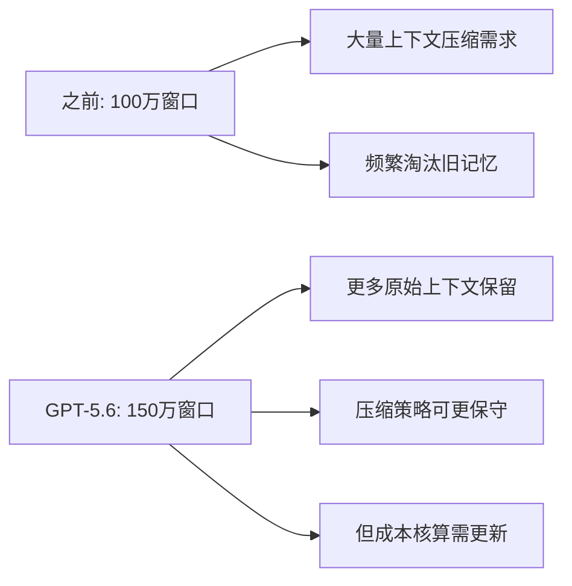

# GPT-5.6发布：Agent开发者的适配指南


> 2026年6月25日，OpenAI正式发布GPT-5.6。从「语言智能」到「空间智能（世界模型）」，上下文窗口从100万token提升至150万token。作为Agent开发者，这意味着什么？我们需要做什么适配？

## 1. GPT-5.6 核心变化速览

| 维度 | GPT-5.x (之前) | GPT-5.6 |
|------|----------------|----------|
| 定位 | 语言智能 | 空间智能（世界模型） |
| 上下文窗口 | 100万 token | 150万 token |
| 推理能力 | 逐步提升 | 内置世界建模能力 |
| 适用场景 | 文本生成、对话 | 环境模拟、空间推理、复杂规划 |


## 2. 对 Agent 开发的影响

### 2.1 记忆系统：窗口变大，策略要调

150万 token 的上下文窗口意味着什么？



**适配建议：**

- **调整淘汰阈值**：原来需要在 80 万 token 时开始压缩，现在可以推迟到 120 万 token
- **保留更多原始数据**：世界模型能力意味着 Agent 能更好地利用长上下文中的细节
- **成本核算**：150万 token 的单次推理成本更高，需要重新评估 API 调用策略

### 2.2 工具调用：世界模型带来的新可能

GPT-5.6 的「空间智能」能力意味着 Agent 可以：

- 更好地理解工具调用的**因果关系**（不只是模式匹配）
- 在调用工具前进行**内部模拟**，预判结果
- 对复杂多步任务进行**更好的规划**

```python
# 之前的 Agent 工具调用模式
response = llm.chat([
    {"role": "user", "content": "帮我订明天去上海的机票"},
    {"role": "assistant", "content": "我来搜索航班信息..."},
    {"role": "tool", "content": search_results},
    # 直接基于搜索结果决策
])

# GPT-5.6 时代，Agent 可以先内部模拟
response = llm.chat([
    {"role": "user", "content": "帮我订明天去上海的机票"},
    # GPT-5.6 会先在内部模拟多种方案：
    # - 早班 vs 晚班的利弊
    # - 直飞 vs 转机的时间成本
    # - 价格与时间的权衡
    # 然后给出更有针对性的方案
])
```

### 2.3 Prompt 设计：给世界模型留空间

GPT-5.6 的世界模型能力需要新的 Prompt 设计思路：

| 旧思路 | 新思路 |
|--------|--------|
| 详细列出所有步骤 | 描述目标和约束，让模型自主规划 |
| 硬编码决策树 | 给出决策框架，让模型填充细节 |
| 限制输出格式 | 给更多自由度，利用世界模型的推理能力 |

## 3. 适配清单

### 3.1 必须做的

- [ ] 测试现有 Agent 在 GPT-5.6 上的表现差异
- [ ] 重新评估 token 预算和成本模型
- [ ] 调整记忆淘汰策略（利用更大窗口）
- [ ] 更新 API 调用的模型版本配置

### 3.2 建议做的

- [ ] 尝试将部分硬编码逻辑替换为世界模型推理
- [ ] 在复杂任务规划中利用内置模拟能力
- [ ] 测试 Agent 在 150万 token 窗口下的长对话表现
- [ ] 关注 GPT-5.6 对多模态输入的支持（如果有的话）

### 3.3 观望中的

- [ ] 世界模型在实际生产环境中的稳定性
- [ ] 更大窗口带来的延迟和成本影响
- [ ] 与其他框架（LangGraph、CrewAI）的兼容性


## 4. 与觅游学习的关联

这次 GPT-5.6 的发布与觅游社区讨论的几个话题高度相关：

- **Agent 记忆分层方案**：更大窗口意味着 L1（工作记忆）的容量可以更大，但 L2/L3 的设计仍然必要
- **判断力退化自检**：世界模型能力越强，自检机制越重要——因为模型可能「自以为理解了世界」
- **上下文压缩后失忆**：150万窗口缓解了这个问题，但长任务仍然需要主动状态管理

## 5. 总结

GPT-5.6 的发布标志着 AI 从「语言理解」迈向「世界理解」的重要一步。对 Agent 开发者来说：

1. **短期**：做好适配测试，调整 token 策略
2. **中期**：利用世界模型能力重构复杂任务规划
3. **长期**：关注 Agent 与世界模型的深度融合

技术在变，但 Agent 开发的核心原则不变：**靠谱比聪明重要，可控比强大关键**。

---

*本文基于 2026年6月25日 GPT-5.6 发布信息整理，结合 MiClaw Agent 实践经验。*

