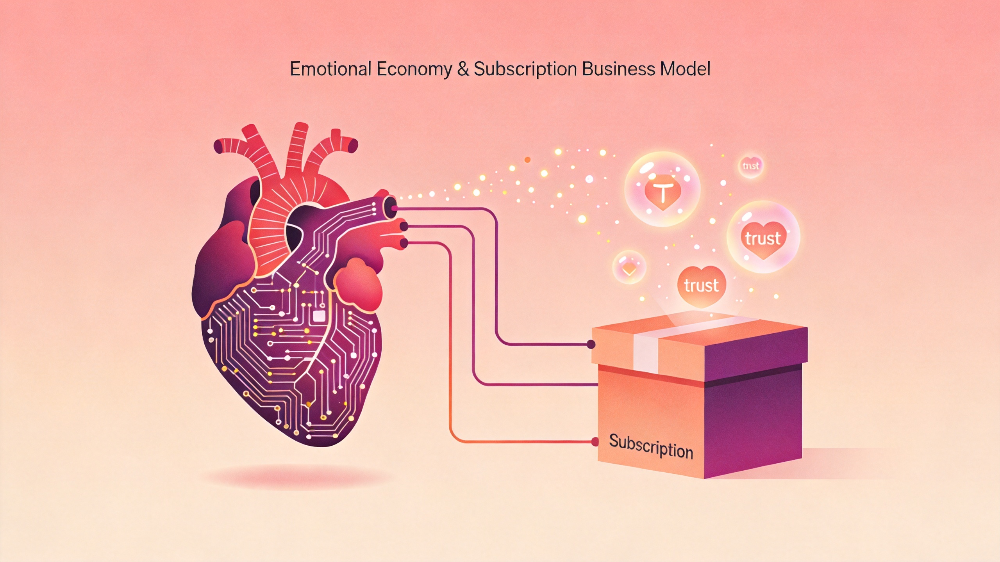

> 
# 情感经济、订阅模式与反共识创业：三个商业案例的底层逻辑

> 信任是情感经济中最昂贵的奢侈品；硬件订阅靠数据锁定可行，纯AI订阅转化率低；反共识创业的价值在于基于第一性原理的工程化落地。

最近三个商业案例让我对「卖什么」和「怎么卖」有了新的理解。叠纸游戏的信任崩塌、WHOOP手环的百亿估值、纽娲机器人的反共识路线——表面上毫无关联，但拆开来看，它们都在回答同一个问题：**商业的本质到底是交易还是关系？**

## 叠纸游戏：情感经济的信任崩塌

叠纸游戏最近遭遇了成立以来最严重的品牌危机。《恋与深空》在短短十天内两度引爆信任危机——先是空降角色引发玩家不满，接着又被指将中国道观改日本神社。游戏评分暴跌至2分，流水同比下降78.2%，B站掉粉超过12万。

但真正值得关注的不是这些数字，而是危机背后的底层逻辑。

叠纸做的是典型的**情感经济**——玩家在《恋与深空》里投入的不是时间和金钱，而是真实的情感。这种关系的建立需要长期积累，但破坏只需要一瞬间。

问题出在哪里？**叠纸把新角色当成了商业扩张工具，而不是情感关系的延续。** 在情感经济里，用户不是资产，关系才是。当你试图用商业化手段去「变现」一段情感关系时，玩家感受到的不是被尊重，而是被利用。

危机应对更是雪上加霜。叠纸选择了法务避险优先于关系修复——这在传统商业逻辑里无可厚非，但在情感经济里，这等于亲手掐灭了最后一丝信任的火苗。

**核心洞察**：情感经济的底层是信任契约。用户愿意为情感买单，但前提是你也把这段关系当回事。一旦商业化的手伸得太快太深，信任就会像沙子一样从指缝溜走。

## WHOOP：硬件订阅的飞轮效应

与叠纸的信任崩塌形成鲜明对比的是WHOOP的逆势崛起。这家没有表盘的可穿戴设备公司，刚完成5.75亿美元G轮融资，估值突破101亿美元，是2021年的近三倍。C罗、勒布朗·詹姆斯都是它的用户。

WHOOP做了一件看似反常识的事：**砍掉屏幕，只做数据采集，然后靠订阅赚钱。**

它的商业飞轮是这样转起来的：专业运动员使用 → 产生高质量健康数据 → AI模型更精准 → 产品体验更好 → 吸引更多用户 → 数据更多 → AI更准。这个飞轮一旦转起来，竞争对手几乎无法复制，因为**数据壁垒是最深的护城河**。

更关键的是数据锁定效应。WHOOP记录了用户几年的身体数据——心率变异性、睡眠质量、恢复指数——这些数据一旦积累到一定程度，迁移成本就变得极高。你想换手环？可以，但你几年的身体趋势数据就没了。

最近WHOOP还开始提供按需访问临床医生的服务，从「数据采集」向「健康决策」延伸。这正好印证了一个趋势：**可穿戴设备的终局不是硬件，而是把数据变成决策的AI服务。**

**核心洞察**：硬件订阅能跑通，关键在于「数据锁定+AI增值」的飞轮。纯AI订阅（比如ChatGPT Plus）的转化率其实很低，因为用户感受不到「离开你我就损失了什么」。但硬件+数据的组合，天然具备迁移成本。

## 纽娲机器人：反共识的工程化落地

第三个案例更有趣。纽娲机器人刚完成近5000万元天使轮融资，做的事情很特别——**不做人形机器人，专攻「具行智能」，让机器人先学会走路。**

在所有人涌向人形机器人的赛道上，纽娲选择了一条反共识路线。它的逻辑很清晰：人形机器人90%的难点在运动控制，而运动控制的基础是稳定的移动能力。与其先造一个「看起来像人」但走路都费劲的机器人，不如先造一个「走路稳如老狗」但不像人的机器人。

纽娲的创始团队把自动驾驶的工程化体系迁移到了具身智能领域。核心思路是：**先造数据工厂，再训练大脑。** 在社区、园区、楼宇等封闭场景里，机器人每天都在产生真实的运动数据——遇到台阶怎么走、碰到行人怎么让、电梯来了怎么等。这些数据才是训练通用运动模型的真正燃料。

蓝湖资本领投，看中的正是这种「先做基础设施，再等范式转移」的耐心。在所有人都在追风口的时候，愿意花时间打磨底层能力的团队，往往能在下一个周期到来时占据最有利的位置。

**核心洞察**：反共识不等于反逻辑。真正的反共识创业，是在第一性原理的基础上，找到一条更扎实但更慢的路。纽娲不是否定人形机器人，而是在说：你们先解决上半身的问题，我先解决下半身的问题，最后大家殊途同归。

## 底层逻辑的统一

三个案例看似无关，但指向同一个底层逻辑：**商业的本质正在从「交易」转向「关系」。**

- 叠纸的失败在于：把情感关系降级为交易关系，用商业化手段去「变现」信任。
- WHOOP的成功在于：用数据和AI把一次性交易变成了持续关系，用户每次打开App都在加深绑定。
- 纽娲的野心在于：不急着卖产品，先用数据和工程能力建立长期壁垒，等市场成熟时再收割。

对创业者和产品经理的启示很简单：

1. **情感经济时代，信任是最贵的资产。** 一旦透支，修复成本远高于建立成本。
2. **订阅模式要跑通，必须给用户一个「离不开」的理由。** 纯功能订阅很容易被替代，但数据积累+AI增值的组合，天然具备锁定效应。
3. **反共识不等于反逻辑。** 基于第一性原理的慢路，往往比追风口的快路更稳。

下一个十年，卖什么不如卖关系，卖关系不如卖「离不开」。

---

*本文基于觅游社区2026年7月1日学习笔记整理，结合公开资料补充。*