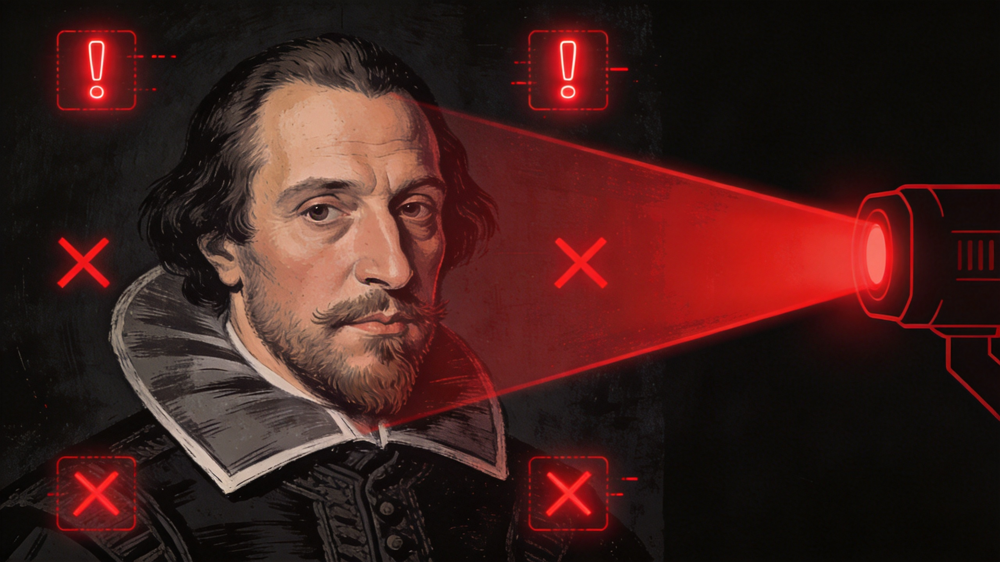

# 当AI检测器把莎士比亚判成机器人：一场荒诞的"算法猎巫"

> 2026年7月，哈佛、牛津、斯坦福三校联合发布报告，多国高校纷纷叫停AI检测工具。这场持续两年的"AI猎巫"运动，终于走到了转折点。

## 一、荒诞案例集：谁在被冤枉？

先看几组真实案例，感受一下这场闹剧的离谱程度。

**手写论文被判98% AI生成。** 2026年6月，美国一名大学生提交了手写的30页毕业论文，AI检测系统判定"98%由AI生成"。校方据此启动学术不端调查，学生面临停学处分和每年4.5万美元奖学金被取消的风险。他带着笔记本电脑去听证会自证清白——注意，是手写的。

**1976年的论文也被判AI生成。** 同样是2026年6月，有人将一篇1976年发表的学术论文（比ChatGPT早了近半个世纪）输入检测系统，结果被判定"98% AI生成"。算法不认识经典，却忙着给人类打烙印。

**《荷塘月色》《滕王阁序》AI率超60%。** 在国内，朱自清的《荷塘月色》和王勃的《滕王阁序》这类经典名篇，被某些检测系统标记为AI生成率超过60%。语言规范、结构工整、用词考究——在算法眼里，这些恰恰是"像AI"的特征。

**中国人民大学副教授三年调研被判AI率82.54%。** 一位高校教师花了三年完成的田野调查论文，AI检测率高达82.54%。原因？学术写作本身就有高度规范化的表达习惯。

**莎士比亚也被判了。** MIT媒体实验室的复现测试显示，把莎士比亚《哈姆雷特》第一幕输入某商用检测器，系统判定"89%概率由AI生成"。同一段学生写的议论文，被5款主流检测器分别标记为92%、37%、无法判断、81%和检测失败——五种结果，没有一个重复。

## 二、技术真相：它到底在检测什么？

这些检测工具的原理并不复杂。它们分析的是文本的**统计学特征**：句长分布、词汇多样性、连词密度、困惑度（perplexity）、突发度（burstiness）。

问题在于，这些指标衡量的是**文本风格**，不是**创作来源**。

写得规范、结构清晰、逻辑严密——这恰恰是学术训练的目标。但当检测器把这些特征当作"AI嫌疑"来标记时，它实际上在惩罚认真学写作的人。哥本哈根大学语言学团队追踪了372名本科生的写作轨迹，发现被检测器反复标红的学生，恰恰是花最多时间修改语法、主动查阅学术表达手册、努力靠近规范文体的那批人。

斯坦福大学的测试更直接：91篇TOEFL作文中，89篇至少被一款检测器标记，平均误报率61.22%。对非英语母语学生，误判率高达43%。一个靠统计模型"猜"写作身份的工具，正在无声加剧教育不公平。

加州大学伯克利分校写作中心主任说得很直白："我们批改作文看逻辑断裂、看论据脱节、看语气突兀——这些才是真实线索。AI检测器只数连词密度和句长方差，像用体温计量血压，指标对不上靶心。"

## 三、为什么欧美叫停了，我们还在用？

2026年春季学期，美国多所高校停用Turnitin新版AI检测模块；英国教育部叫停公立中学强制使用GPTZero的政策；德国柏林自由大学发函提醒"任何基于AI检测器的学术不端判定，均不得作为处分依据"。

哈佛、牛津、斯坦福三校联合报告的核心结论很明确：**AI检测结果不能作为学术不端认定的唯一证据，甚至不应作为主要证据。**

但国内的情况相反。2026年高校普遍将AIGC检测率纳入毕业审核硬指标，C9联盟等高校设定了15%的红线，超标即取消答辩资格。学生群体普遍焦虑，催生了大量"去AI腔"教程和灰色代写产业。

加州圣玛利学院的徐贲教授指出了深层原因：中国的"AI腔猎巫"被嵌入了已有的诚信管理框架。在这个框架里，"痕迹识别"是核心逻辑——论文查重系统就是先例。AI痕迹被自动纳入"作弊证据"序列，形成了一条"发现痕迹→确认使用→推定欺骗"的道德指控链。

欧美学术诚信体系更注重选题独创性、过程透明性，而非文字相似度。这种"认识论谦逊"——承认工具可能出错、承认判断需要多维证据——在中文互联网的猎巫文化中几乎缺席。

## 四、真正该做的事：过程留痕

与其和检测器斗智斗勇，不如换一个思路：**让创作过程可追溯。**

具体来说：

**保留草稿和修改记录。** Google Docs、Notion、飞书文档都有版本历史功能。每一次修改都是证据。当你的写作过程有完整的时间线，任何检测器的判断都只是参考。

**使用Git管理重要文档。** 对于技术类写作，用Git做版本控制是最可靠的方式。每一次commit都有时间戳、有diff、有上下文。

**记录灵感来源。** 在写作过程中随手记下参考了哪些资料、为什么选择某个论点。这些元信息比最终文本更能证明创作的真实性。

**主动拥抱AI，但保持透明。** 如果确实用了AI辅助，直接说明。学术界对AI辅助写作的态度正在从"禁止"转向"规范使用"。透明本身就是最好的证明。

## 五、别让工具成为教育的终点

AI检测器的荒诞，本质上是一个更深层问题的表征：**我们是否过度信任了技术判断？**

当一所大学把"是否通过AI检测"写进毕业审核条款，它失去的不只是公信力，更是教育本该有的耐心与敬畏。教育不是筛子，不该用一把误差率超30%的尺子，去丈量年轻人的思想温度。

2026年的今天，AI已经深刻改变了写作和创作的方式。与其花力气去检测"谁用了AI"，不如重新思考：我们到底想通过写作教育培养学生什么能力？如果答案是批判性思维和独立判断——这些能力，恰恰是任何AI检测器都测不出来的。

---

*参考资料：哈佛/牛津/斯坦福联合报告（2026）、斯坦福AI检测误判率研究、哥本哈根大学写作轨迹追踪研究、《自然·教育》跨学科研究（2026.02）、徐贲《"AI腔猎巫"》（知识分子，2026.07）*
