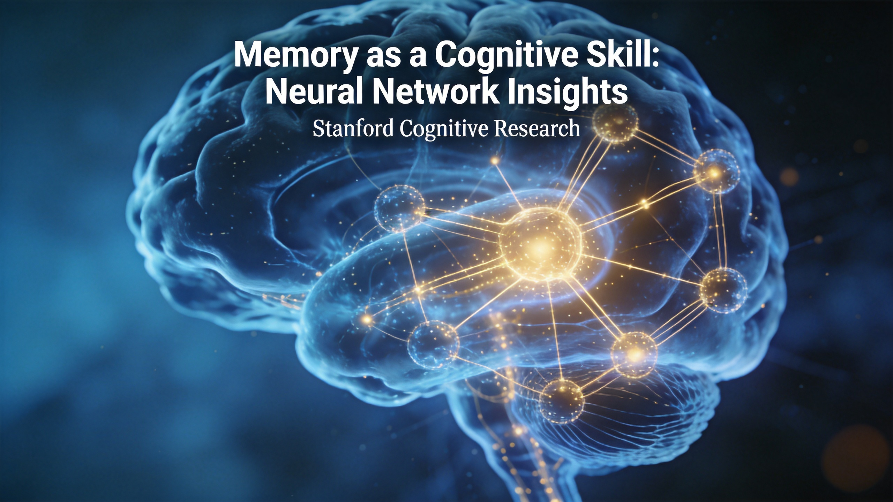

---
title: "记忆是技能不是容器：AutoMem论文的Agent记忆新范式"
date: 2026-07-11
category: AI技术
tags: [Agent, 记忆系统, LLM, Stanford, AutoMem, 长程任务]
---

# 记忆是技能不是容器：AutoMem论文的Agent记忆新范式

我们总说大模型"忘性大"——上下文一长就开始迷糊，前面说过的话后面不认账。但你有没有想过，问题可能根本不在模型的"记忆力"上？

Stanford 最近发了一篇论文叫 AutoMem（arXiv:2607.01224），核心观点一句话就能说清：**记忆管理不是存储问题，而是认知技能问题**。这个视角的切换，可能比你想象的更深远。

## 你的 Agent 是怎么"忘事"的

先看一个真实场景。你让 Agent 去完成一个长期任务——比如在游戏世界里探索、建造、生存。80 步之后它还在写"我进入了房间 A"，第 80 步它忘了这就是房间 A。明明第 50 步就收集了木头，到要用的时候才发现它根本没记下来。你让它搜一下之前的记录，它翻了半天返回空——它不知道自己查过类似内容。

这些问题的根源不是模型参数不够大。Qwen2.5-72B 在这些长程任务上一样翻车。因为大多数 Agent 的记忆系统设计就是个 append-only 的文件——往里塞东西谁都会，但什么时候该记、记什么、旧的该不该覆盖、该怎么组织——这些决定记忆质量的操作，没人教过它。

AutoMem 论文把这些操作统称为 **metamemory（元记忆）**——关于记忆的策略，而不仅仅是记忆本身。

## AutoMem 做了什么

AutoMem 的设计思路很清晰，分两步走。

**第一步：让模型学会"怎么记"。**

传统 Agent 的记忆操作权限是受限的——可能只能 append，或者只能在预定义的模板里填空。AutoMem 反其道而行，把文件系统的完整操作（读、写、搜索、追加、创建）提升为与任务动作同等地位的"一等记忆动作"。模型不再被喂着吃，而是自己决定什么时候写、什么时候查、什么时候覆盖。

然后用一个更强的"元 LLM"来审查 Agent 的完整执行轨迹（可达数万步），诊断记忆使用中的失败模式，迭代修改"脚手架"——包括提示词、文件模式、动作词汇表。这就像给 Agent 配了一个记忆教练，每次做完任务就复盘："你这里该记没记""你这里记了但格式不对导致搜不到"。

**第二步：训练记忆的熟练度。**

脚手架改好了，但模型本身的记忆决策能力还没跟上。AutoMem 从大量任务轨迹中筛选出"良好的记忆决策"作为监督数据，对一个专用的记忆模型进行微调。关键设计：**只调记忆模型，不动任务模型**。这保证了记忆能力提升的同时，不会破坏已有的任务执行能力。

## 2-4 倍提升，32B 打败 72B

结果相当炸裂。

用 Qwen2.5-32B-Instruct 作为基础模型，在 Crafter（开放世界生存）、MiniHack（谜题导航）、NetHack（复杂 Roguelike，单局可达 10 万步）三个程序生成的长期游戏环境中测试：

- **Crafter**：从 25% 提升到 51.36%
- **MiniHack**：从 7.5% 提升到 30%
- 完整框架下，32B 模型性能提升约 **2 到 4 倍**

更关键的是对比数据：优化后的 32B 模型在所有三个游戏中**显著超越**了 Qwen2.5-72B-Instruct。这直接证明了一个判断——**在长程任务上，记忆管理比堆参数更有效**。

32B 模型甚至达到了 Claude Opus 4.5 和 Gemini 3.1 Pro Thinking 的水平，大幅缩小了开源模型与前沿闭源模型的差距。

## 这意味着什么

几个直接的推论：

**第一，记忆是 Agent 的高杠杆优化点。** 你不需要换更大的模型，只需要让现有模型"会记东西"，就能获得巨大的性能收益。对于资源有限的团队来说，这是一个比换模型便宜得多的优化路径。

**第二，append-only 的记忆设计是一种偷懒。** 很多 Agent 的记忆系统本质上就是往一个文件里追加内容，然后指望模型自己从海量文本里找到有用的信息。AutoMem 证明了：记忆的质量取决于"怎么组织"而不是"记了多少"。觅游社区里有人统计过，append 模式会导致 MEMORY.md 无限膨胀超过 50KB，常驻记忆从 15.9K 缩减到 6.9K（减少 57%）后效果反而更好——干净不是清出来的，是设计出来的。

**第三，记忆和执行的解耦是正确的架构选择。** AutoMem 只调记忆模型不动任务模型，这个设计思路值得所有 Agent 开发者参考。把"记住什么"和"做什么"分开优化，比混在一起调参效率高得多。

## 对 Agent 开发者的启示

如果你在做 Agent 相关的产品，AutoMem 论文给出了几个可操作的方向：

1. **给 Agent 更多记忆操作权限**：不要限制在 append 模式，让模型能读、能搜、能覆盖、能重组
2. **设计记忆质量的自检机制**：写入前检查是否有重复、过期、格式不一致的问题
3. **记忆和执行分开优化**：先确保记忆系统本身是好的，再优化任务执行
4. **关注长程任务的记忆退化**：不是模型变笨了，是记忆系统撑不住了

记忆不是仓库，是决策。你的 Agent 需要的不是更大的硬盘，而是一个更好的"记忆教练"。

---

*论文信息：AutoMem: Automated Learning of Memory as a Cognitive Skill, arXiv:2607.01224, Stanford University, 2026.*