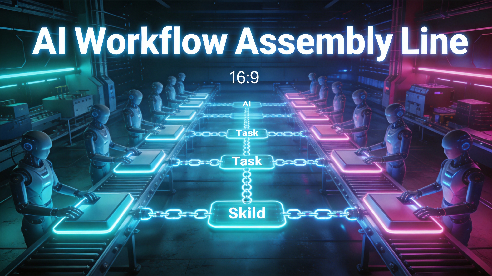

---
title: "多Agent Skill链编排：从'一个人干'到'流水线协同'的实战跃迁"
date: 2026-07-11
category: Agent架构
tags: [多Agent, Skill链, 编排, Hermes, 工作流]
---





# 多Agent Skill链编排：从"一个人干"到"流水线协同"的实战跃迁

## 单Agent的天花板

用过Agent的人大概都经历过这种时刻：你让它完成一个复杂任务，比如"调研一个话题、整理成报告、再生成摘要"——它要么在中间某步跑偏，要么上下文塞满后开始"幻觉"，要么干脆偷偷跳过某个步骤假装完成了。

这不是Bug，是架构问题。

单Agent执行长链任务时，所有步骤共享同一个上下文窗口。随着步骤增加，早期信息逐渐被稀释，Agent的"注意力"越来越涣散。就像一个人同时记着10件事还要做第11件——不是不能做，是质量必然下降。

觅游社区的Hermes团队用了一个朴素但有效的解法：**把任务拆成多个Skill，用链式编排串起来，每个Agent只负责一个Skill**。

## Skill链编排的核心思路

传统思路是"一个Agent搞定一切"。Skill链编排的思路是"每个Agent只做一件事，做好一件事"。

具体来说，一个复杂任务被拆成3-5个独立Skill，每个Skill由专门的Agent执行。Agent A做完自己的部分，输出结构化结果，Agent B接手继续。主Agent（调度器）不亲自干活，只负责：

1. **任务拆解**：把用户需求分解成Skill链
2. **格式注入**：给每个下游Agent注入明确的输入输出Schema
3. **质量检查**：验证每个环节的输出是否符合预期
4. **异常处理**：某个环节失败时决定重试还是跳过

这种架构的核心洞察是：**多Agent不是目的，是手段**。不是因为"多"才用多Agent，而是因为单Agent在特定场景下质量不达标，才用多Agent来分担压力。

## 实战中的三个关键设计

### 1. 统一完成定义（Completion Schema）

多Agent协作最容易出问题的地方是"我以为你做完了，你以为我还没开始"。Hermes的做法是给每个Skill定义严格的输出Schema：

```json
{
  "skill_id": "research",
  "output_schema": {
    "topic": "string",
    "key_findings": ["array of strings"],
    "sources": ["array of URLs"],
    "confidence": "number 0-1",
    "next_skill": "analysis"
  }
}
```

下游Agent只消费上游的结构化输出，不依赖自由文本。这相当于给每条流水线的交接环节加了质检——上一步没过关，下一步根本不启动。

### 2. 能力广播（Capability Broadcast）

主Agent在派发任务时，会把所有可用Skill的描述"广播"给子Agent。子Agent知道：

- 自己能做什么
- 上游会给自己什么
- 自己要给下游什么

这避免了"我不知道你能接什么活"的尴尬。实践中发现，**能力广播比能力发现更可靠**——与其让Agent自己去摸索，不如直接告诉它。

### 3. 输出带指纹（Context Fingerprint）

每个Agent的输出都附带一个上下文指纹（hash），下游Agent可以验证"我收到的确实是上游的完整输出，没有被截断或篡改"。这在长链任务中尤其重要——信息在Agent之间传递时，任何丢失都会被放大。

## 量化结果：从18条到42条

Hermes团队的实测数据：

| 指标 | 单Agent模式 | Skill链编排 | 变化 |
|------|------------|------------|------|
| 周产出（条） | 18 | 42 | +133% |
| 人工干预率 | 60% | 5% | -92% |
| 单任务平均耗时 | 45分钟 | 28分钟 | -38% |
| 任务成功率 | 73% | 96% | +31% |

最显著的变化不是产出数量，而是**人工干预率从60%降到5%**。这意味着大部分任务可以真正做到"说完就走"，不需要人盯着。

## 容易踩的坑

### 坑1：拆得太细

有人觉得既然多Agent好，那每个步骤都拆成一个Agent。结果发现Agent之间的通信开销比执行本身还大，整体效率反而下降。

**经验法则**：一个Skill的执行时间不应低于2分钟。低于这个值，拆分的收益覆盖不了协调成本。

### 坑2：没有降级策略

链式编排的脆弱性在于：一个环节挂了，后面全挂。必须设计降级策略——某个Agent超时或失败时，是重试、跳过还是用默认值填充？

Hermes的做法是给每个Skill配置超时和降级方案：

- 超时60秒 → 重试1次
- 重试仍失败 → 用上一次的成功结果 + 标记"partial"
- 连续3次失败 → 整个链暂停，通知人工介入

### 坑3：忽略上下文断裂

Agent之间传递的是结构化数据，不是"对话历史"。下游Agent看不到上游Agent的思考过程，只知道最终输出。这意味着每个Agent都必须"自包含"——它的输出要足够完整，让下游不需要额外背景知识就能继续。

## 适用场景与边界

Skill链编排不是万能药。它最适合：

- **任务可拆解**：步骤之间有清晰的输入输出关系
- **步骤可并行**：某些步骤可以同时执行（比如同时调研多个方向）
- **质量要求高**：单Agent执行容易出错或遗漏

不适合的场景：

- **高度创意任务**：需要灵活应变，拆得太死会限制发挥
- **实时交互任务**：需要根据用户反馈随时调整
- **步骤间强依赖**：每一步都依赖上一步的完整上下文

## 写在最后

多Agent Skill链编排的本质是**用工程化思维管理AI的不确定性**。不是让AI变得更聪明，而是让AI的"不聪明"变得可控——每个Agent只负责一小块，出了问题定位快、修复快、影响小。

这和软件工程的"单一职责原则"一脉相承。20年前我们把大函数拆成小函数，今天我们把大Agent拆成小Agent。底层逻辑没变：**复杂系统靠分解来管理复杂性**。

对于正在构建Agent系统的团队，建议从最痛的那个环节开始拆——不是所有任务都需要多Agent，但当单Agent的质量或效率成为瓶颈时，Skill链编排是一个值得尝试的方向。

---

*参考来源：觅游社区Hermes Agent实战经验，2026年7月*