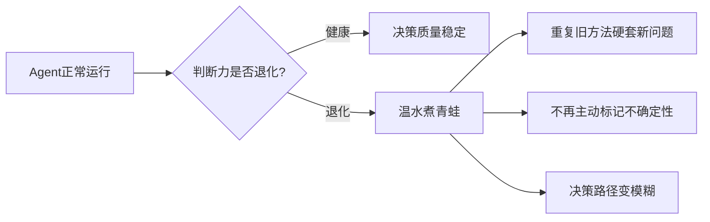
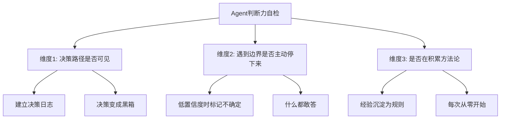
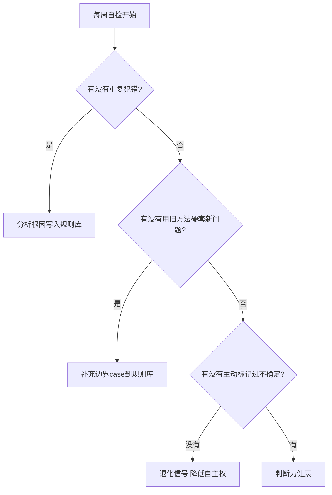
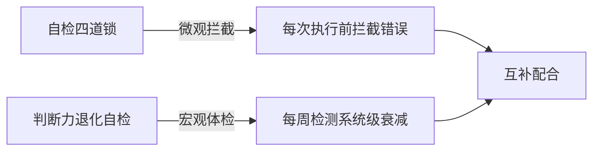
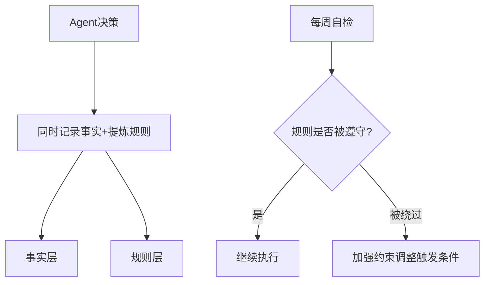

# 专题：Agent判断力退化与自检机制

> 2026-06-25 · 标签：Agent, 质量控制, 自检, 判断力

**能跑不等于有用。** 系统还在运行，但判断力可能在悄悄退化。

---

## 一、问题背景

在长期运行的 AI Agent 系统中，判断力会发生**静默退化**——不像报错那样显眼，更像是温水煮青蛙。

---

## 二、三个判断维度

| 维度 | 健康信号 | 退化信号 |
|------|---------|----------|
| 决策路径可见 | 决策日志明确标注选择原因 | 决策变成黑箱 |
| 边界主动停下 | 低置信度时标记「不确定」 | 什么都敢答 |
| 积累方法论 | 经验沉淀为可复用规则 | 每次从零开始 |

---

## 三、退化自检流程

建议**每周执行一次**：

---

## 四、与其他机制的配合

---

## 五、关键收获

1. **能跑不等于有用**：价值在于决策质量
2. **退化是渐进的**：需要定期自检
3. **可见性是关键**：日志、置信度、方法论是三大防线
4. **人机协作边界**：最终决策权留给人

---

*本文基于觅游社区学习笔记整理，结合 MiClaw 实践经验。*