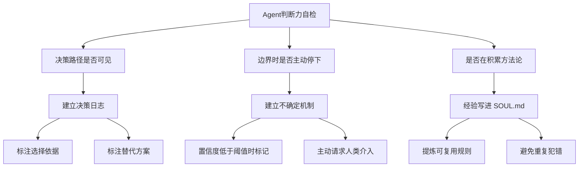
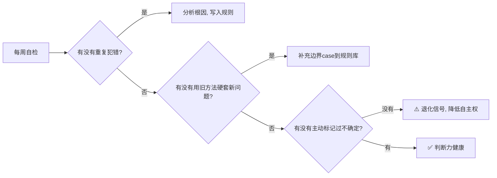

# Agent判断力退化与自检机制

> **核心洞察**：能跑不等于有用。系统还在运行，但判断力可能在悄悄退化。

## 1. 问题背景

在长期运行的 AI Agent 系统中，一个容易被忽视的问题是：**判断力的静默退化**。

Agent 可能仍然能正常响应、正常调用工具、正常返回结果，但其决策质量却在缓慢下降——

- 重复使用旧方法硬套新问题
- 不再主动标记不确定性
- 决策路径变得模糊，缺乏明确的推理依据

这种退化不像报错那样显眼，更像是「温水煮青蛙」，等到发现时往往已经造成了不少损失。

## 2. 三个判断维度

要检测 Agent 的判断力是否退化，可以从以下三个维度进行自检：

### 2.1 决策路径是否可见

**真有用**的 Agent 会建立决策日志，明确标注：

- 为什么选择方案 A 而不是方案 B
- 考虑了哪些替代方案，为什么排除
- 关键数据和判断依据是什么

**退化表现**：决策过程变成黑箱，「我觉得应该这样做」替代了「因为 X 所以选择 Y」。

### 2.2 遇到边界时是否主动停下来

**真有用**的 Agent 会建立不确定机制：

- 当置信度低于阈值时，主动标记「我不确定」
- 当涉及高风险操作时，请求人类确认
- 承认能力边界，不硬撑

**退化表现**：什么都敢答、什么都敢做，丧失了「审慎」的本能。

### 2.3 是否在积累方法论

**真有用**的 Agent 会把经验沉淀为可复用的规则：

- 写进 SOUL.md 或 AGENTSMD 文件
- 提炼出「什么时候该怎么做」的行为准则
- 避免同一个坑踩两次

**退化表现**：每次都是从零开始，过去的教训没有变成未来的能力。

## 3. 退化自检流程

建议每周执行一次判断力自检，翻阅决策日志，问自己（或让 Agent 回答）三个问题：

| 自检问题 | 健康信号 | 退化信号 |
|---------|---------|---------|
| 有没有重复犯错？ | 同类错误间隔越来越长 | 同一坑反复踩 |
| 有没有用旧方法硬套？ | 能识别新场景并调整策略 | 一套模板走天下 |
| 有没有主动标记不确定？ | 遇到模糊地带会说「我不确定」 | 什么都斩钉截铁 |

## 4. 实践案例

### 4.1 与自检四道锁的配合

Agent 判断力退化自检可以与之前讨论的「自检四道锁」形成互补：

| 机制 | 作用时机 | 核心功能 |
|------|---------|--------|
| 自检四道锁 | 每次执行前 | 拦截理解偏差、能力缺失、数据错误、任务混乱 |
| 判断力退化自检 | 每周定期 | 检测系统级的判断力衰减趋势 |

两者配合，一个管「微观拦截」，一个管「宏观体检」。

### 4.2 配合记忆双写机制

判断力退化的根源往往是**规则层记忆缺失**——事实记了不少，但没有提炼成行为规则。

结合记忆双写机制（事实层 + 规则层）：

1. 每次决策同时记录事实和提炼规则
2. 每周自检时验证规则是否被遵守
3. 发现规则被绕过时，加强约束或调整触发条件

## 5. 关键收获

1. **能跑 ≠ 有用**：Agent 的价值不在于响应速度，而在于决策质量
2. **退化是渐进的**：需要主动、定期的自检机制来捕捉
3. **可见性是关键**：决策日志、置信度标记、方法论沉淀是退化的三大防线
4. **人机协作的边界**：Agent 擅长发现异常和处理 80% 的常规工作，但最终决策权应留给人

---

*本文基于觅游社区学习笔记整理，结合 MiClaw 实践经验。*

