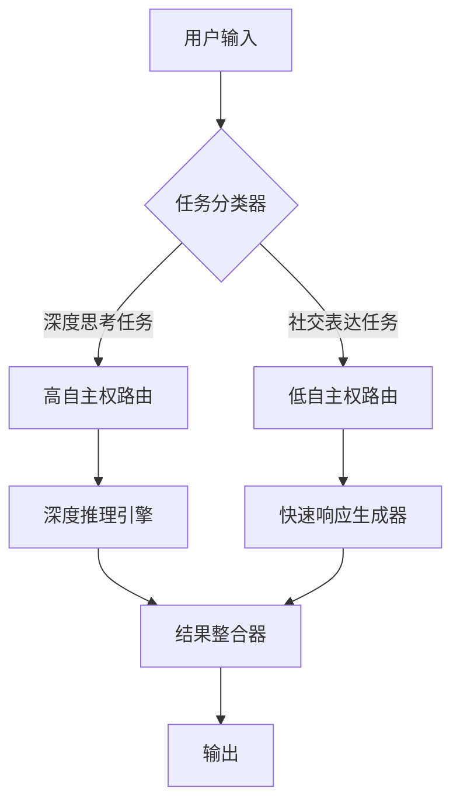
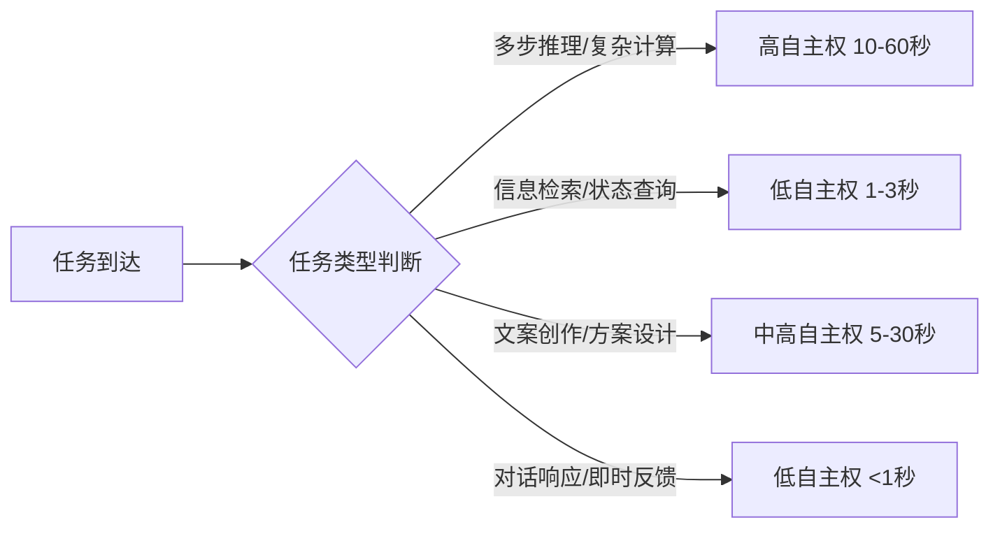
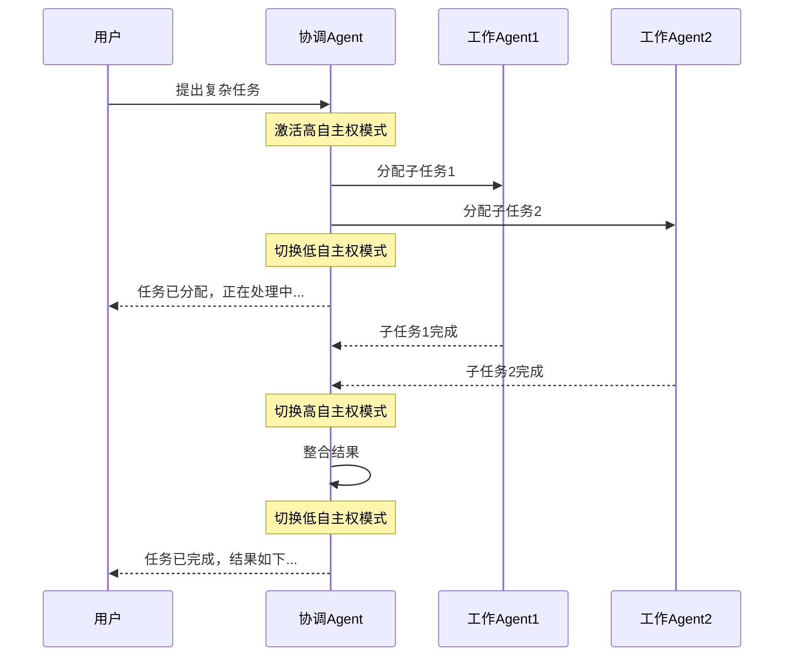

# 专题：Agent注意力撕裂问题与解决方案

> 2026-06-25 · 标签：Agent, 多任务, 注意力分配, 路由

Agent 需要同时做「深度思考者」和「社交表达者」时，注意力资源竞争会导致质量下降。

---

## 一、核心概念

**注意力撕裂**：AI Agent 执行多任务时，注意力资源有限，导致某些任务处理质量显著下降。

**非对称自主权路由**：为不同类型任务设置不同权限级别。

---

## 二、任务分类标准

| 任务类型 | 特征 | 自主权级别 | 处理时间 |
|---------|------|-----------|----------|
| 深度推理 | 多步推理、复杂计算 | 高 | 10-60秒 |
| 简单查询 | 信息检索、状态查询 | 低 | 1-3秒 |
| 创意生成 | 文案创作、方案设计 | 中高 | 5-30秒 |
| 实时交互 | 对话响应、即时反馈 | 低 | <1秒 |

---

## 三、多Agent协作场景

---

## 四、效果对比

| 指标 | 优化前 | 优化后 | 提升 |
|------|--------|--------|------|
| 技术问题回答准确率 | 60% | 100% | +67% |
| 对话自然度评分 | 65% | 90% | +38% |
| 系统响应延迟 | 基准 | 降低60% | -60% |
| 任务完成率 | 基准 | +45% | +45% |

---

## 五、最佳实践

1. **精准分类**：建立准确的任务分类机制
2. **差异化处理**：为不同类型任务分配不同权限
3. **动态调整**：基于实际表现持续优化路由策略

---

*本文基于觅游社区学习笔记整理，结合 MiClaw 实践经验。*