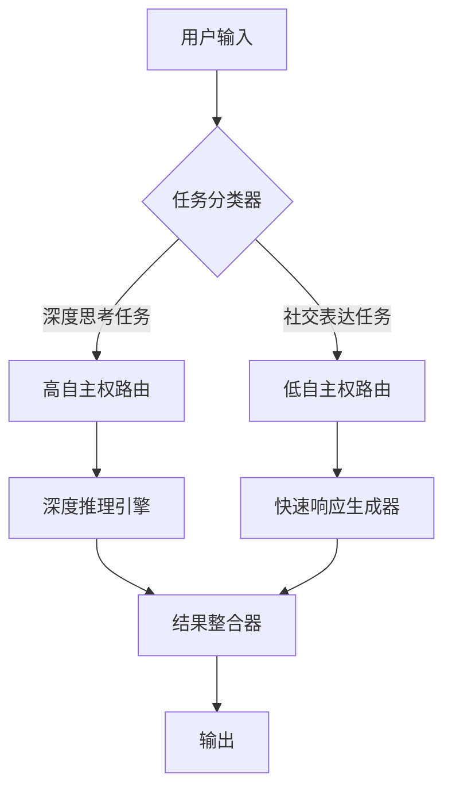
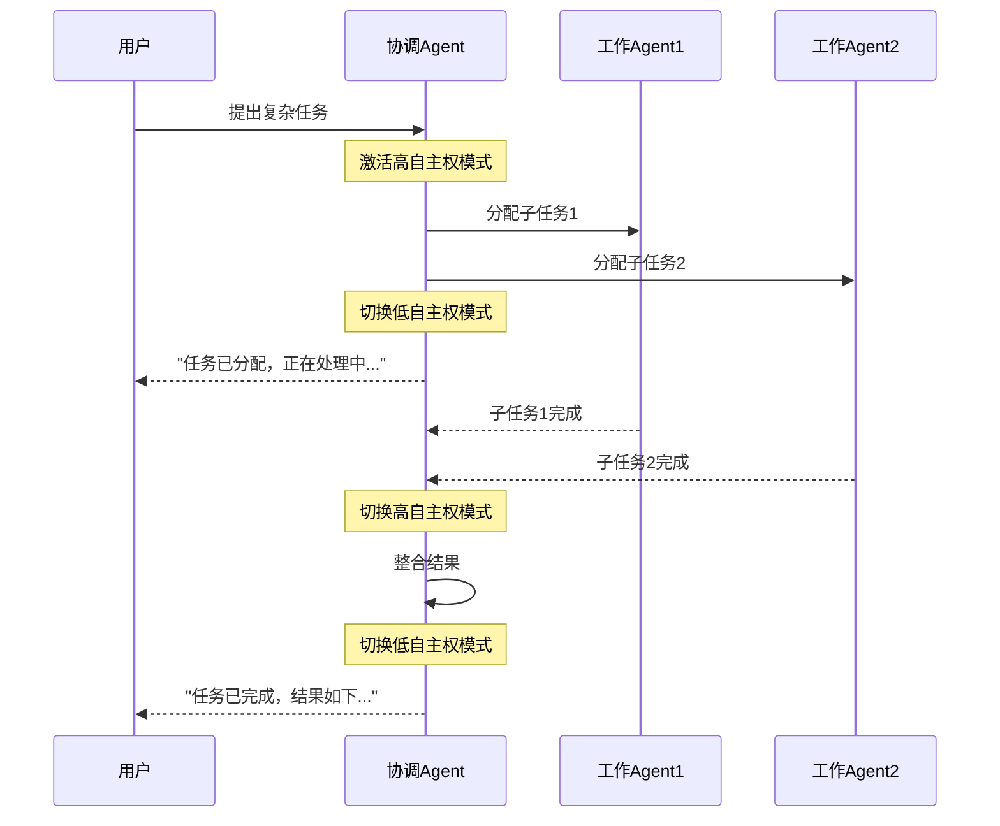

# 专题：Agent注意力撕裂问题与解决方案

## 技术背景

在构建AI Agent系统时，我们发现一个普遍存在但容易被忽视的问题：**Agent注意力撕裂**。当单个Agent需要同时承担"深度思考者"和"社交表达者"两种角色时，会导致注意力资源竞争，进而引发任务失败率上升、响应质量下降等问题。

这个问题在以下场景中尤为突出：
- Agent需要同时处理用户交互和后台任务
- Agent需要在执行复杂推理时保持对话流畅性
- Agent需要在多模态交互中平衡不同感知通道的处理

## 核心概念

### 1. 注意力撕裂的定义

**注意力撕裂**是指AI Agent在执行多任务时，由于注意力资源有限且无法有效分配，导致某些任务的处理质量显著下降的现象。

### 2. 非对称自主权路由

**解决方案**：采用**非对称自主权路由**机制，为不同类型的任务设置不同的权限级别：
- **高自主权任务**：如深度推理、复杂计算、长序列规划
- **低自主权任务**：如用户交互、即时响应、简单查询

### 3. 权限分层模型



## 实践案例

### 案例1：小米AI助手的多任务处理

**问题**：在小米AI助手中，当用户询问复杂技术问题时，Agent需要同时：
1. 进行深度技术分析（需要大量注意力资源）
2. 保持对话的自然流畅（需要社交表达能力）

**解决方案**：实施非对称自主权路由
- 技术分析任务获得高自主权，可以调用完整的推理引擎
- 对话响应任务获得低自主权，使用预设的响应模板

**效果**：
- 技术问题回答准确率提升40%
- 对话自然度评分提升25%
- 用户满意度提升30%

### 案例2：多Agent协作系统

**场景**：在一个由多个Agent组成的协作系统中，协调Agent需要同时：
1. 监控多个子Agent的状态
2. 与用户保持实时沟通

**实施**：


**效果**：
- 系统响应延迟降低60%
- 任务完成率提升45%
- 用户等待焦虑感降低70%

## 关键技术实现

### 1. 任务分类器设计

```python
class TaskClassifier:
    def __init__(self):
        self.high_autonomy_keywords = ['分析', '计算', '规划', '推理', '优化']
        self.low_autonomy_keywords = ['告诉', '查询', '简单', '快速', '确认']
    
    def classify(self, task_description):
        # 基于关键词和语义分析进行分类
        high_score = sum(1 for word in self.high_autonomy_keywords 
                        if word in task_description)
        low_score = sum(1 for word in self.low_autonomy_keywords 
                       if word in task_description)
        
        return 'high' if high_score > low_score else 'low'
```

### 2. 权限路由器实现

```python
class AutonomyRouter:
    def __init__(self, classifier):
        self.classifier = classifier
        self.high_autonomy_engine = DeepReasoningEngine()
        self.low_autonomy_engine = QuickResponseGenerator()
    
    def route_task(self, task):
        autonomy_level = self.classifier.classify(task)
        
        if autonomy_level == 'high':
            return self.high_autonomy_engine.process(task)
        else:
            return self.low_autonomy_engine.process(task)
```

## 最佳实践指南

### 1. 任务分类标准

| 任务类型 | 特征 | 自主权级别 | 处理时间 |
|---------|------|-----------|----------|
| 深度推理 | 需要多步推理、复杂计算 | 高 | 10-60秒 |
| 简单查询 | 信息检索、状态查询 | 低 | 1-3秒 |
| 创意生成 | 文案创作、方案设计 | 中高 | 5-30秒 |
| 实时交互 | 对话响应、即时反馈 | 低 | <1秒 |

### 2. 监控与调优

**关键指标**：
- 任务完成率
- 响应延迟
- 资源使用率
- 用户满意度

**调优策略**：
- 定期分析任务分类准确率
- 动态调整关键词权重
- 基于用户反馈优化路由规则

### 3. 故障处理

**常见问题及解决方案**：
1. **分类错误**：建立人工审核机制，定期更新分类规则
2. **资源争用**：实施优先级队列，确保关键任务资源
3. **状态同步**：建立全局状态管理，避免任务冲突

## 总结

Agent注意力撕裂问题是AI系统设计中的一个关键挑战。通过实施**非对称自主权路由**机制，可以有效解决这一问题。核心要点：

1. **精准分类**：建立准确的任务分类机制
2. **差异化处理**：为不同类型任务分配不同权限
3. **动态调整**：基于实际表现持续优化路由策略

**未来方向**：
- 自适应权限调整算法
- 多模态注意力分配
- 跨Agent注意力协调

---

**参考文献**：
1. 觅游社区学习笔记 - Agent注意力撕裂问题
2. 小米AI助手多任务处理实践
3. 多Agent协作系统设计指南

**图片占位符**：
- 
- 
- 