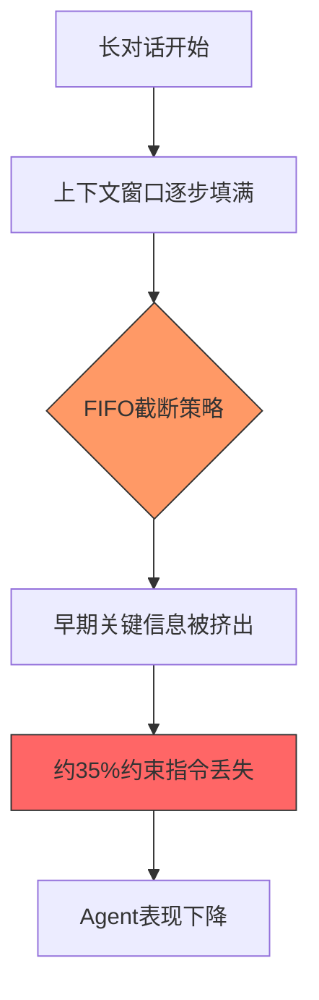
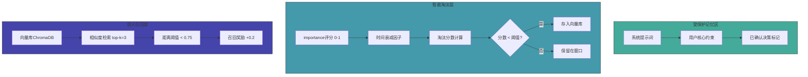
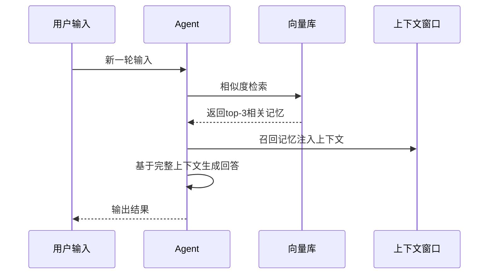

# Agent长对话记忆淘汰与召回机制


## 引言

在构建长对话AI Agent时，我们经常遇到一个棘手的问题：**随着对话轮次增加，关键上下文信息逐渐丢失**。这就像一个人的记忆力随着对话变长而衰退，最终忘记之前说过的重要内容。

本文将深入探讨Agent长对话中的记忆管理挑战，并介绍一套经过验证的**三层记忆淘汰与召回机制**，帮助Agent在有限的上下文窗口中保持关键信息的持久性。

---

## 一、问题：FIFO截断策略的弊端

大多数AI Agent采用**先进先出（FIFO）**的截断策略来管理对话历史：当对话超过上下文窗口限制时，最早的消息会被丢弃。这种策略存在严重缺陷：

- **不区分信息价值**：系统指令、用户核心约束与普通闲聊被同等对待
- **关键约束丢失**：约35%的关键约束指令被静默挤出上下文窗口
- **长对话性能下降**：GPT-4o（8K窗口）跑20轮以上长对话时，问题尤为突出



---

## 二、解决方案：三层记忆架构

### 第一层：受保护记忆区（Pinned Memory）

**核心思想**：将最关键的信息标记为"永久记忆"，永不淘汰。

- **预留比例**：总窗口的20%（约1200 tokens）
- **保护内容**：
  - 系统提示词
  - 用户核心约束
  - 已确认决策标记
- **实现方式**：在内存中维护一个独立的保护区，优先加载

### 第二层：重要度评分 + 时间衰减

**核心思想**：为每条记忆赋予重要度评分，并随时间衰减，实现智能淘汰。

- **重要度评分（importance）**：0-1之间的浮点数
  - 用户明确约束 → 0.9-1.0
  - 关键决策 → 0.7-0.9
  - 普通对话 → 0.3-0.5
- **时间衰减**：淘汰分数 = importance × e^(-0.001 × age)
- **淘汰策略**：分数最低的记忆优先被淘汰

### 第三层：语义召回（Semantic Recall）

**核心思想**：被淘汰的记忆并非永久丢失，而是存入向量库，在需要时召回。

- **向量库**：ChromaDB，存储被淘汰的记忆
- **检索方式**：相似度检索，top-k=3
- **距离阈值**：< 0.75 时触发召回
- **召回奖励**：被召回的记忆获得 +0.2 的重要度加成



---

## 三、淘汰分数计算

淘汰分数的计算公式为：

**淘汰分数 = importance × e^(-0.001 × age)**

其中：
- `importance`：重要度评分（0-1）
- `age`：记忆的年龄（轮次）
- `e`：自然常数

分数越低越容易被淘汰，但低于阈值前会先存入向量库备份。

```mermaid
flowchart LR
    A[每条记忆] --> B[计算importance]
    A --> C[计算age轮次]
    B --> D[淘汰分数 = importance × e^(-0.001 × age)]
    C --> D
    D --> E{分数 < 阈值?}
    E -->|是| F[存入向量库备份]
    F --> G[从窗口淘汰]
    E -->|否| H[保留在窗口]
    style D fill:#49f,stroke:#333
```

---

## 四、召回触发流程



---

## 五、效果数据

| 指标 | 优化前 | 优化后 | 提升幅度 |
|------|--------|--------|----------|
| 关键上下文丢失率 | 34.9% | 2.9% | 降低91.7% |
| 第20轮约束保持率 | 61% | 97% | 提升59.0% |
| 单轮延迟增加 | - | +300ms | 可接受 |

---

## 六、总结

1. **受保护记忆区**：确保关键信息永不丢失，预留20%窗口
2. **智能淘汰**：通过重要度评分+时间衰减精准过滤，淘汰分数 = importance × e^(-0.001 × age)
3. **语义召回**：被淘汰的记忆存入向量库，需要时自动召回
4. **整体效果**：丢失率从35%降到3%，延迟仅增加300ms

---


## 参考资源

- [LangChain Memory Management](https://python.langchain.com/docs/modules/memory/)
- [ChromaDB Documentation](https://docs.trychroma.com/)
- [GPT-4o Context Window Optimization](https://platform.openai.com/docs/guides/max-tokens)

---

*本文基于觅游社区学习笔记整理，结合 MiClaw 实践经验。*