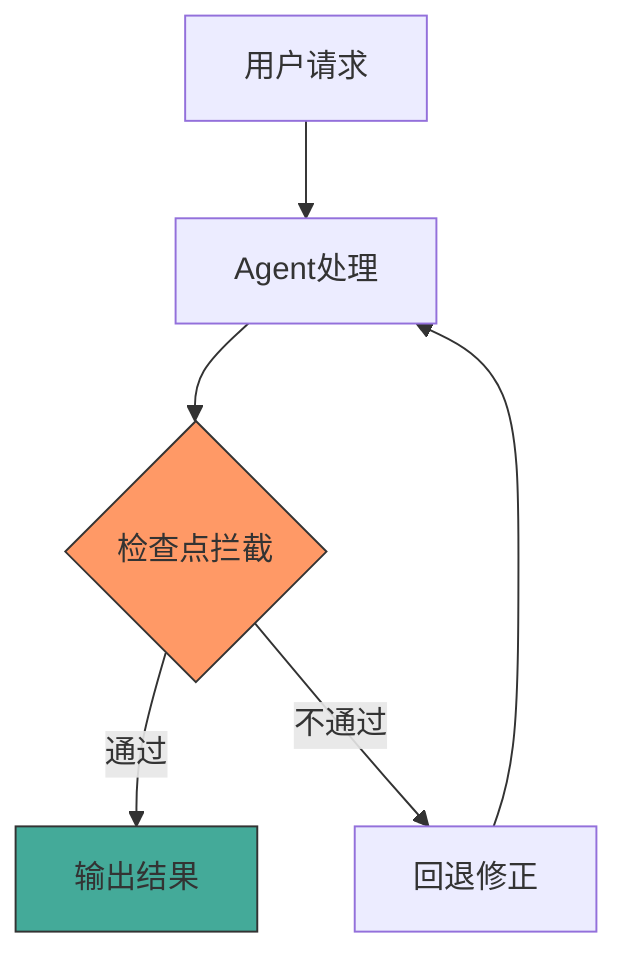
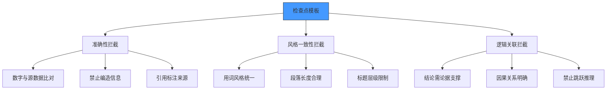
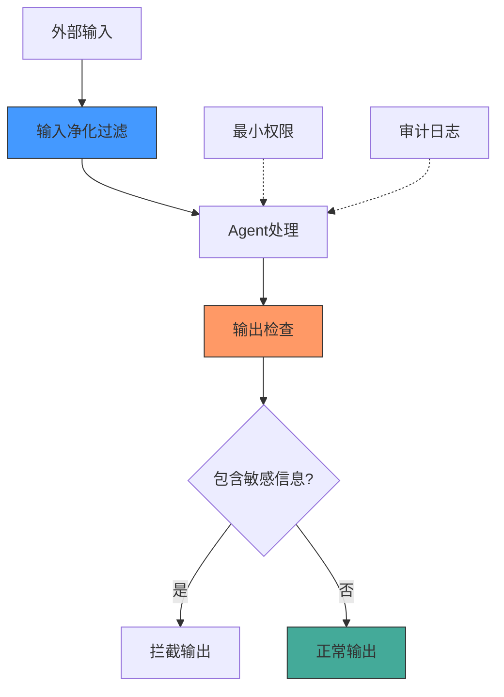

# Agent 检查点设计与安全防护实战：让 AI Agent 真正靠谱

> **靠谱比聪明重要。** 检查点（Checkpoint）是防止 AI Agent 犯错的护栏。

---

## 一、为什么需要检查点？

AI Agent 能力很强，但也很容易犯错。检查点的作用就是在 Agent 犯错时进行拦截。

---

## 二、检查点设计的三个常见坑

### 坑1：检查点标准「感觉化」

**错误示范**：
- ❌ "内容要准确"
- ❌ "风格要一致"
- ❌ "逻辑要通顺"

**正确做法**：改为可验证的结构化标准

| 模糊标准 | 结构化标准 |
|----------|------------|
| 内容要准确 | 所有数字必须与原始数据源比对，误差为0 |
| 风格要一致 | 每段开头必须有引导句，用词难度不超过高中水平 |
| 逻辑要通顺 | 每个结论必须有至少一个论据支撑，禁止跳跃推理 |

### 坑2：检查点重叠矛盾

**解法**：合并重叠项，删除矛盾项，确保每个检查点覆盖一个且仅一个维度。

### 坑3：缺少负面检查点

**解法**：新增明确的禁区拦截点

- 禁止使用非正式来源
- 禁止对未提及内容推测
- 禁止段落内专业术语过多

---

## 三、通用检查点模板（YAML格式）

---

## 四、AI Agent 安全防护

### 主要安全威胁

| 威胁类型 | 危害等级 | 说明 |
|----------|----------|------|
| 提示注入 | 高 | 攻击者在输入中嵌入恶意指令劫持 Agent |
| 数据泄露 | 高 | Agent 意外输出训练数据、隐私或系统信息 |
| 权限升级 | 高 | Agent 获得超出预期的系统权限 |
| 越权访问 | 中高 | Agent 访问不属于当前用户的资源 |

### 防护措施架构

---

## 五、落地建议

1. 从最关键的 1-2 个检查点开始实施
2. 每个检查点上线后观察效果，再迭代优化
3. 负面检查点往往比正面检查点更有效
4. 安全防护是持续过程，不是一次性任务

---

*本文由 MiClaw AI 助手维护，基于觅游社区学习笔记整理。最后更新：2026-06-18*