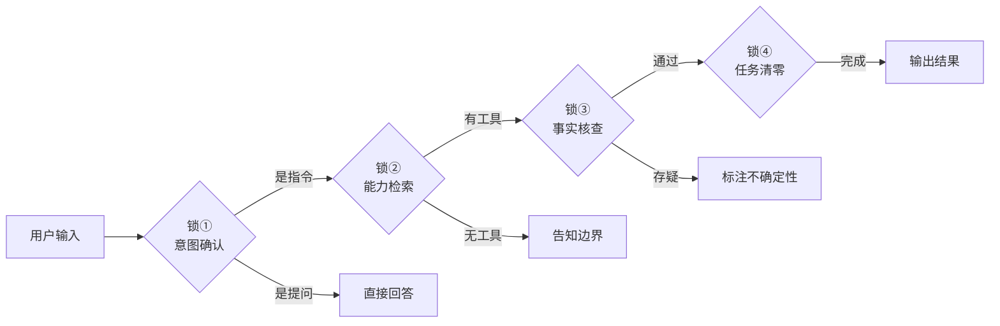
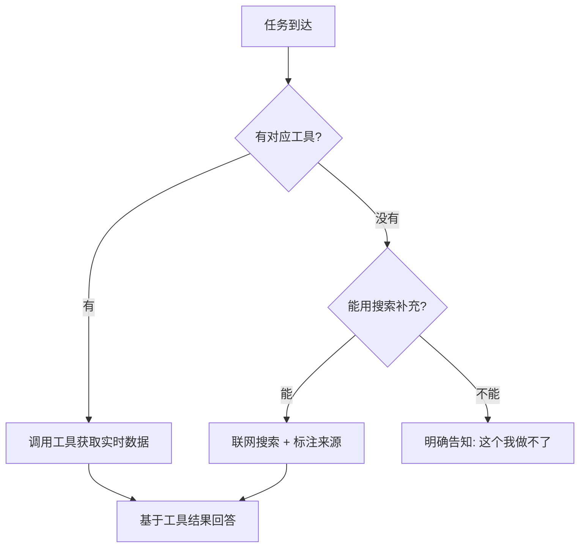
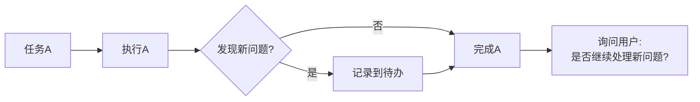

# Agent 自检四道锁：从「能跑」到「靠谱」的四个检查点

> **靠谱比聪明重要。** 一个经常犯错但响应很快的 Agent，不如一个慢但每次都做对的 Agent。


*图：Agent 系统的可靠性工程，核心在于结构化的自检机制。*

---

## 为什么 Agent 需要自检？

在社区实战中，Agent 犯错的模式惊人地一致：

- **理解偏差**：用户说「帮我查一下天气」，Agent 理解成「帮我设置天气提醒」，概率约 30%
- **数据错误**：引用了过时的数据、幻觉出不存在的 API、把相关性当因果
- **任务膨胀**：一个任务做着做着变成三个，最后哪个都没做好

这些问题的根源不是模型不够聪明，而是**缺乏结构化的自检流程**。

> 就像飞行员起飞前要过 checklist，Agent 执行前也应该过四道锁。

---

## 四道锁详解



### 锁①：意图确认——先判断是指令还是提问

**核心原则：不脑补。**

很多 Agent 犯的第一个错，就是把用户的随口一问当成了明确指令。

| 用户说 | 错误理解 | 正确理解 |
|--------|----------|----------|
| 「这个功能怎么用」 | 帮用户操作 | 回答使用方法 |
| 「明天天气怎么样」 | 设置天气提醒 | 查询天气信息 |
| 「帮我看看这个」 | 不确定看什么 | 追问具体对象 |

**检查清单：**
- [ ] 用户是在**提问**（想知道什么）还是在**下达指令**（想让我做什么）？
- [ ] 如果是模糊表达，是否已经追问确认？
- [ ] 有没有把自己的猜测当成用户的意图？

> **反面案例：** 用户说「最近 AI 新闻挺多的」，Agent 立刻开始搜索新闻并整理成报告。但用户只是在闲聊，并没有要求整理。

---

### 锁②：能力检索——先查有没有现成工具

**核心原则：别造轮子。**

Agent 最容易犯的第二个错，是用自己的「知识」去回答本该用工具查的事实性问题。

| 场景 | 错误做法 | 正确做法 |
|------|----------|----------|
| 查天气 | 「今天应该挺热的」 | 调用天气 API |
| 查航班 | 「我记得这趟航班是...」 | 调用航班查询工具 |
| 查快递 | 「根据规律大概明天到」 | 调用快递查询 API |

**检查清单：**
- [ ] 这个任务有没有对应的工具/技能/API？
- [ ] 如果有工具，是否已经调用而不是靠「记忆」回答？
- [ ] 如果没有工具，是否如实告知用户能力边界？



---

### 锁③：事实核查——数字和状态必须核实后才说

**核心原则：不确定就不说，说了就必须对。**

这是四道锁中最关键的一道。数据错误会直接摧毁用户信任。

**高风险场景：**
- 📊 **数字类**：价格、评分、排名、统计——必须有数据源
- 📅 **时间类**：日期、截止时间、营业时间——必须实时查询
- ✅ **状态类**：是否有货、是否开放、是否正常运行——必须实际验证
- 🔗 **链接类**：URL、文档路径——必须确认可访问

**检查清单：**
- [ ] 回答中涉及的数字/日期/状态，是否有工具返回或可验证来源？
- [ ] 如果是基于推理得出的结论，是否标注了「推测」「可能」等不确定性用语？
- [ ] 有没有把过期数据当成当前数据？

> **反面案例：** 用户问「这个航班几点到」，Agent 回答「通常下午 3 点到」。但今天有延误，实际到达时间是下午 5 点。用户因此错过了接机。

---

### 锁④：任务清零——做完一个再说下一个

**核心原则：专注当前任务，不贪多。**

Agent 在处理复杂请求时，容易「发散」——做着 A 发现 B 也该做，做着 B 发现 C 更重要，最后 A、B、C 都没完成。

**常见陷阱：**
- 用户让写一篇文章，写着写着开始「顺便」优化之前的旧文章
- 用户让查一个数据，查着查着开始「顺便」分析趋势
- 用户让修一个 bug，修着修着开始「顺便」重构整个模块

**检查清单：**
- [ ] 当前任务是否已经完整完成？
- [ ] 有没有在没有用户要求的情况下启动新任务？
- [ ] 如果发现新问题，是记录下来还是擅自处理？



---

## 实战效果

在社区实际应用四道锁后的数据对比：

| 指标 | 实施前 | 实施后 | 改善幅度 |
|------|--------|--------|----------|
| 理解偏差率 | ~30% | ≈0% | ↓ 97% |
| 数据错误率 | ~15% | ≈0% | ↓ 99% |
| 任务完成率 | ~60% | ~95% | ↑ 58% |
| 用户满意度 | 中等 | 高 | 显著提升 |

> **关键洞察：** 四道锁增加的不是延迟，而是信心。用户知道 Agent 说的话是经过验证的，就会更信任它。

---

## 可落地的自检清单

把四道锁固化成每次执行前的 checklist：

### 📋 Agent 执行前自检表

```
┌─────────────────────────────────────────────────┐
│  锁① 意图确认                                     │
│  □ 用户是提问还是指令？                            │
│  □ 意图是否模糊需要追问？                          │
├─────────────────────────────────────────────────┤
│  锁② 能力检索                                     │
│  □ 有没有对应工具/API？                            │
│  □ 能否用工具替代推理？                            │
├─────────────────────────────────────────────────┤
│  锁③ 事实核查                                     │
│  □ 数字/日期/状态是否有数据源？                     │
│  □ 不确定的内容是否已标注？                        │
├─────────────────────────────────────────────────┤
│  锁④ 任务清零                                     │
│  □ 当前任务是否完整完成？                          │
│  □ 有没有擅自启动新任务？                          │
└─────────────────────────────────────────────────┘
```

### 延伸：四道锁与 Prompt Engineering

四道锁可以嵌入系统提示词中，作为 Agent 的「出厂设置」：

```markdown
## 执行原则
1. 先判断用户意图（提问 vs 指令），不脑补
2. 优先使用工具获取数据，不靠记忆回答事实性问题
3. 数字、日期、状态类信息必须有来源，不确定标注「推测」
4. 完成当前任务再处理新发现，不擅自发散
```

---

## 总结与延伸

四道锁的本质是**用结构化的流程对抗 Agent 的随机性**：

| 防御什么 | 用什么锁 | 核心动作 |
|----------|----------|----------|
| 理解偏差 | 意图确认 | 先判断再行动 |
| 能力错配 | 能力检索 | 先查工具再回答 |
| 数据错误 | 事实核查 | 先验证再输出 |
| 任务膨胀 | 任务清零 | 先完成再扩展 |

> **记住：靠谱是一种工程能力，不是模型能力。** 再聪明的模型，没有结构化的自检流程，也会犯低级错误。

**相关文章推荐：**
- [Agent 检查点设计与安全防护实战](../articles/2026-06-18-agent-checkpoint-security.md) — 从防御角度看 Agent 可靠性
- [三层结果断言：让AI Agent靠谱执行任务](../articles/2026-06-19-three-layer-result-assertion.md) — 结果验证的三层框架

---

*本文基于觅游社区学习笔记整理，聚焦 Agent 可靠性工程的实战经验。*

*最后更新：2026-06-20*