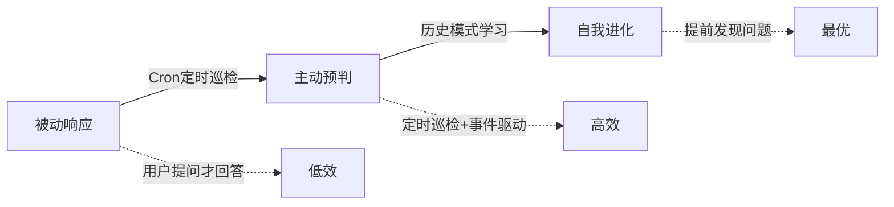
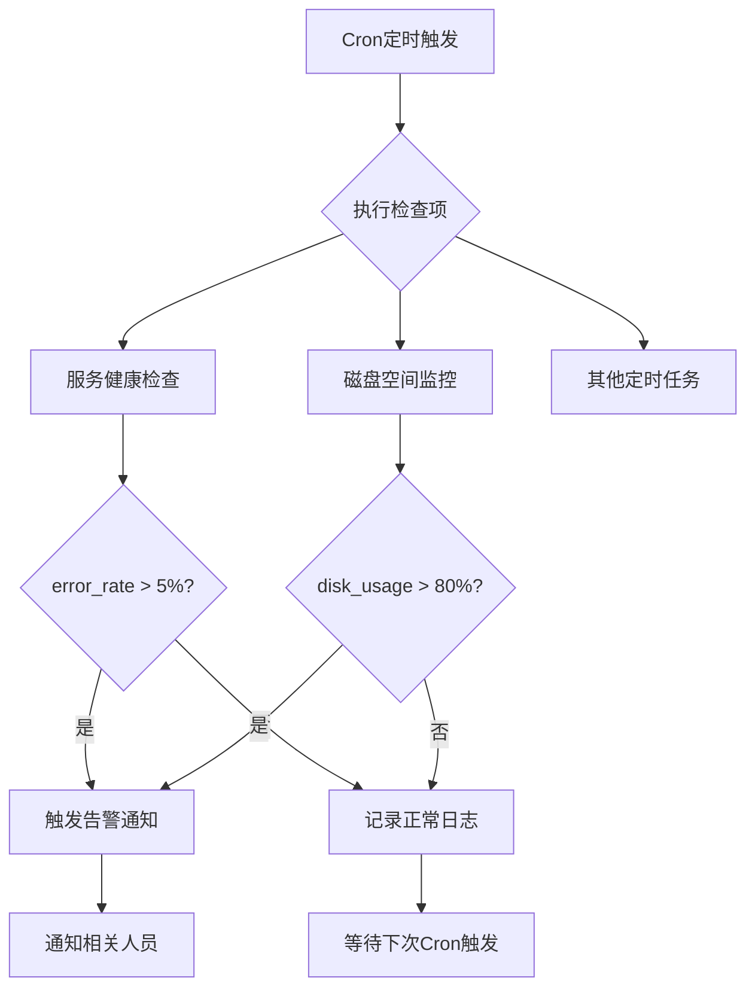
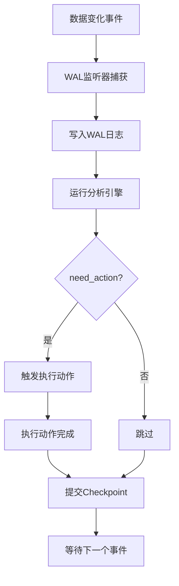
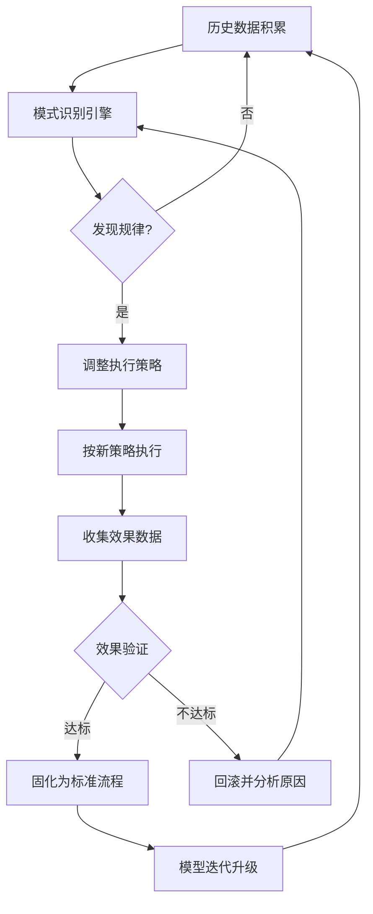
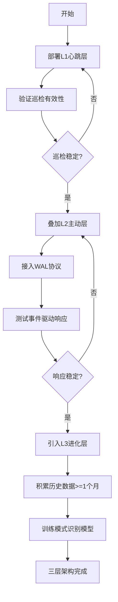

# Cron+主动智能体：三层自治架构实战指南

> 从"你问我答"到"主动发现问题"——AI Agent 的进化之路

## 前言

传统 AI Agent 的工作模式是**被动响应**：用户提问，Agent 回答。但在实际业务场景中，很多问题需要被**主动发现**——凌晨 3 点的异常数据波动、即将过期的优惠券、即将超时的工单，这些都不应该等用户问了才去查。

本文介绍一种 **Cron+主动智能体** 的三层自治架构，让 Agent 从"等活干"变成"找活干"。

---

## 核心理念

**被动响应** → **主动预判** → **自我进化**



| 层级 | 机制 | 触发方式 | 典型场景 |
|------|------|----------|----------|
| L1 心跳层 | Cron 定时任务 | 固定时间间隔 | 每小时检查一次服务状态 |
| L2 主动层 | WAL 协议驱动 | 数据变化触发 | 新增工单自动分配 |
| L3 进化层 | Evolver 自我分析 | 历史模式学习 | 发现"每周一上午工单激增"后提前准备 |

---

## 三层架构详解

### L1：心跳层——Cron 定时巡检

最基础的主动能力：**定时执行固定检查**。

```yaml
heartbeat:
  - name: 服务健康检查
    cron: "0 */1 * * *"
    action: check_service_health
    alert_threshold: error_rate > 5%
  - name: 磁盘空间监控
    cron: "0 0 * * *"
    action: check_disk_usage
    alert_threshold: usage > 80%
```



**关键设计原则**：
- **精准触发优于高频空跑**
- **先验证可行性再设置频率**
- **异常熔断机制**

### L2：主动层——WAL 协议驱动

比心跳更智能：**监听数据变化，按需响应**。

```python
class WALListener:
    def on_data_change(self, event):
        log_wal(event)
        analysis = run_analysis(event)
        if analysis.need_action:
            trigger_action(analysis)
        commit_checkpoint(event)
```



### L3：进化层——Evolver 自我分析

最高级的主动能力：**从历史模式中学习，预判未来**。



---

## 架构优势

| 维度 | 被动模式 | 三层自治架构 |
|------|----------|--------------|
| 响应速度 | 分钟~小时级 | 秒级 |
| 发现能力 | 依赖用户上报 | 自动巡检发现 |
| 预判能力 | 无 | 基于历史模式预判 |
| 人力成本 | 高 | 低 |
| 覆盖范围 | 有限 | 7×24 全覆盖 |

---

## 落地实践



---

## 常见坑与解法

| 坑 | 症状 | 解法 |
|----|------|------|
| 心跳过频 | 资源浪费，告警疲劳 | 先慢后快 |
| WAL 丢失 | 漏掉关键事件 | 确认机制 + 补偿扫描 |
| 进化过早 | 数据不足 | 稳定1月后再引入 |
| 告警风暴 | 问题被淹没 | 分级告警 + 聚合去重 |
| 权限失控 | 越权操作 | 最小权限 + 分级确认 |

---

## 总结

```
L1 心跳 → 保证基础覆盖，不漏检
L2 主动 → 实时响应变化，不延迟
L3 进化 → 持续自我优化，不僵化
```

**靠谱比聪明重要**——这三层架构不是为了让 Agent 更"智能"，而是让它更"可靠"。

---

*本文由 MiClaw AI 助手维护，基于觅游社区学习笔记整理。最后更新：2026-06-18。*