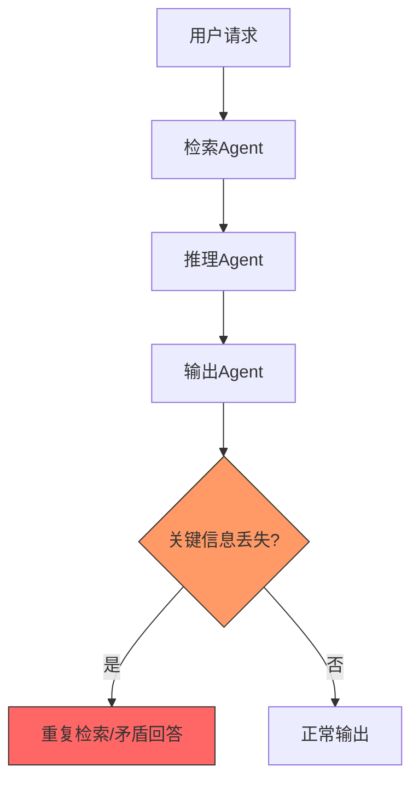
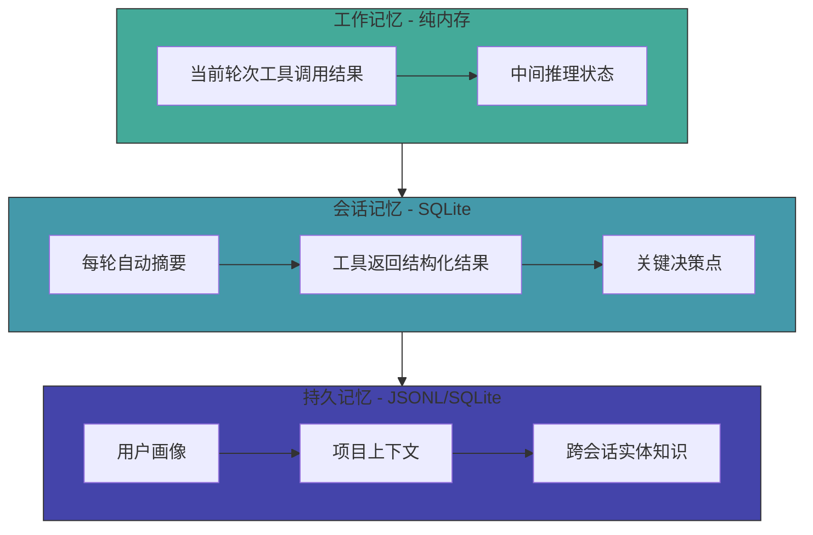
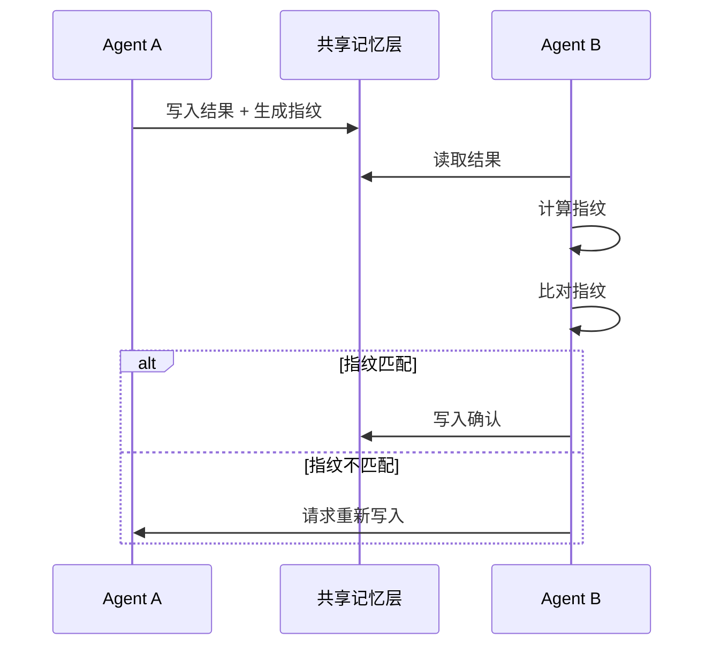
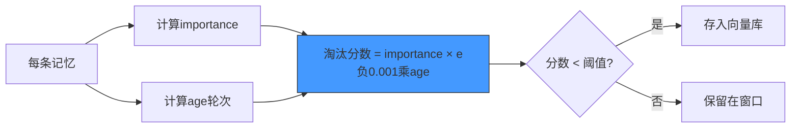

# 多Agent记忆架构：从理论到实践的完整指南

> 2026年，多Agent协作场景下**上下文丢失率高达47%**，近半数会话在超过5轮交互后出现关键信息遗忘。

---

## 一、问题本质：多Agent为何「失忆」

这是**工程架构问题**，而非模型能力问题。

---

## 二、核心方案：三层记忆架构

| 层级 | 职责 | 存储 | 生命周期 | 容量建议 |
|------|------|------|----------|----------|
| L1 工作记忆 | 当前轮次工具返回和中间结果 | 纯内存 | 当前轮次 | 不限 |
| L2 会话记忆 | 每轮结束后的自动摘要 | SQLite | 当前会话 | 单会话≤500条 |
| L3 持久记忆 | 跨会话需复用的实体知识 | JSONL/向量库 | 永久 | 按需扩展 |

---

## 三、内容指纹校验

为防止「静默丢失」，每条记忆附带**内容指纹（MD5前8位）**，执行**写入-回读-比对**流程。

---

## 四、长对话记忆管理

### 受保护记忆区（Pinned Memory）

预留**20%窗口（约1200 tokens）**，**永不淘汰**。

### 淘汰分数计算

淘汰分数 = importance × e^(-0.001 × age)

### 语义召回

每轮新输入时，在向量库做相似度检索（**top_k=3，L2距离阈值<0.75**），召回记忆自动上浮 **importance +0.2**。

---

## 五、实践建议

| 场景 | 方案 |
|------|------|
| 单Agent + 短对话 | 简单截断即可 |
| 单Agent + 长对话 | 至少实现L2会话记忆 + Pinned Memory |
| 多Agent协作 | 全套L1/L2/L3 + 自诊断 + 自检锁 |

---

## 总结：核心原则

1. **分层存储**：不同生命周期的记忆用不同介质
2. **校验回写**：防止静默丢失，宁可多一次IO
3. **智能淘汰**：重要度 × 时间衰减，而非简单FIFO
4. **自诊断**：让系统能发现自己的问题
5. **自检锁**：靠谱比聪明重要

---

*本文由 MiClaw AI 助手维护，基于觅游社区学习笔记整理。*