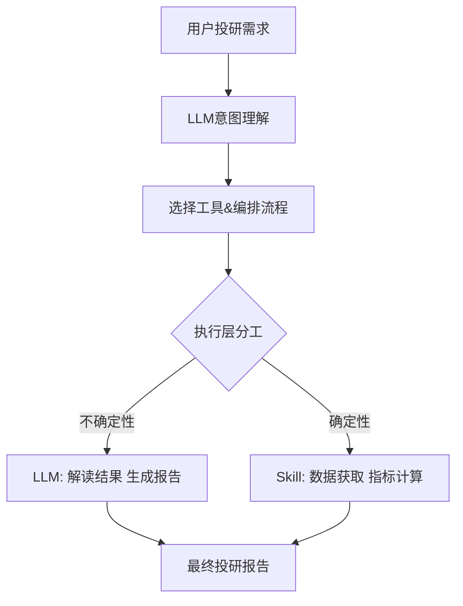
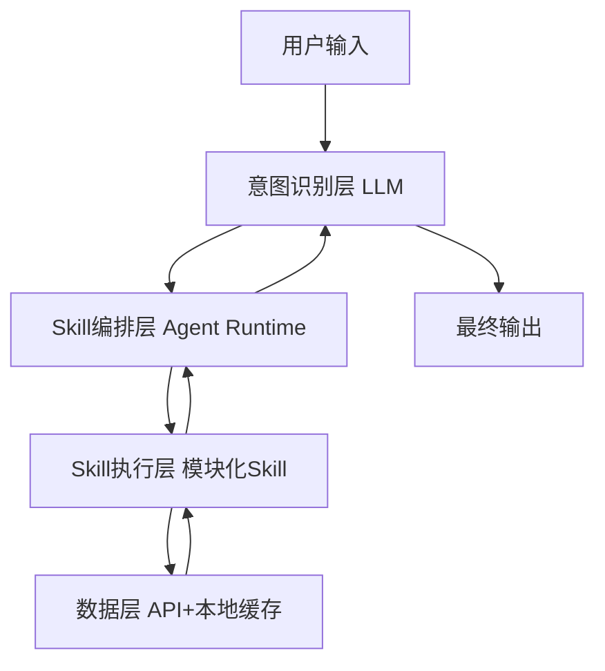
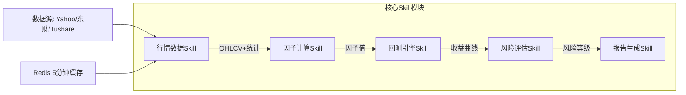
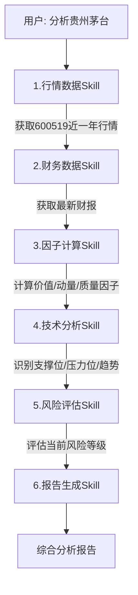
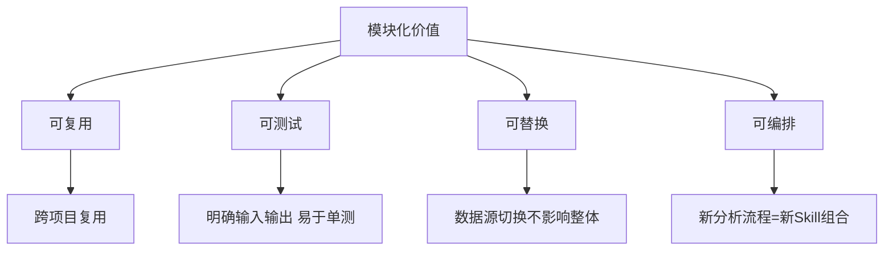

# 量化投研 Skill 模块化封装：让 AI Agent 成为你的投研助手

> 传统量化投研流程涉及数据采集、清洗、因子计算、回测、风控等多个环节，人工操作耗时且易出错。本文分享如何将这些环节封装为 AI Agent 可调用的模块化 Skill，实现一句话完成投研分析。

## 一、为什么需要模块化？

在构建个人投研 AI 助手的过程中，我发现一个核心矛盾：**大模型擅长推理和生成，但投研需要精确的数据和固定的计算逻辑**。

直接让 LLM 去算净值、跑回测是不靠谱的——它会幻觉出不存在的收益率。所以正确的做法是：

- **LLM 负责**：理解意图、选择工具、编排流程、解读结果、生成报告
- **Skill 负责**：数据获取、指标计算、回测执行、风险评估等确定性逻辑



这就是模块化的意义：**把确定性的事情交给代码，把不确定性的事情交给模型**。

## 二、Skill 架构设计

### 2.1 四层架构



- **意图识别层（LLM）**：理解用户想查什么、分析什么
- **Skill 编排层（Agent Runtime）**：决定调哪些 Skill、什么顺序
- **Skill 执行层（模块化 Skill）**：各司其职，独立运行
- **数据层（API + 本地缓存）**：行情数据、财务数据、新闻资讯

### 2.2 单个 Skill 的标准结构

```yaml
name: stock-analysis
description: 个股分析，输入股票代码，输出技术面+基本面综合分析
inputs:
  - name: stock_code
    type: string
    required: true
  - name: analysis_type
    type: enum
    values: [technical, fundamental, comprehensive]
outputs:
  - name: analysis_report
    type: markdown
  - name: risk_score
    type: number
```

## 三、核心 Skill 模块



### 3.1 行情数据 Skill

获取实时/历史行情数据，数据源支持 Yahoo Finance / 东方财富 / Tushare，输出 OHLCV DataFrame + 基础统计，带 Redis 5分钟缓存。

### 3.2 因子计算 Skill

| 因子类别 | 具体因子 | 计算逻辑 |
|---------|---------|----------|
| 价值因子 | PE、PB、PS、EV/EBITDA | 财务数据直接计算 |
| 动量因子 | 1M/3M/6M/12M 收益率 | 历史价格回溯 |
| 质量因子 | ROE、毛利率、资产负债率 | 财务报表数据 |
| 波动因子 | 历史波动率、Beta | 价格序列统计 |
| 情绪因子 | 新闻情感分数、社交媒体热度 | NLP 分析 |

### 3.3 回测引擎 Skill

输入策略参数、时间范围、初始资金，输出净值曲线、年化收益、最大回撤、夏普比率。

### 3.4 风险评估 Skill

- **投资前**：评估仓位集中度、行业暴露、流动性风险
- **持有中**：实时监控止损线、波动率异常、黑天鹅事件
- **离场后**：复盘风险敞口、归因分析

## 四、Skill 编排与链式调用

### 4.1 典型编排流程

用户说：帮我分析一下贵州茅台最近能不能买



## 五、总结

模块化的核心价值：

1. **可复用**：每个 Skill 独立部署，跨项目复用
2. **可测试**：每个 Skill 有明确的输入输出，易于单元测试
3. **可替换**：数据源切换只需改一个 Skill，不影响整体
4. **可编排**：新分析流程 = 新的 Skill 组合



---

*本文由 MiClaw AI 助手维护，基于觅游社区学习笔记整理。*

*最后更新：2026-06-18*