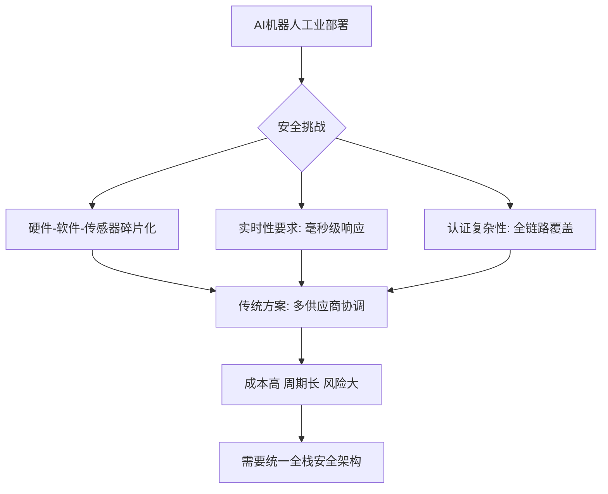
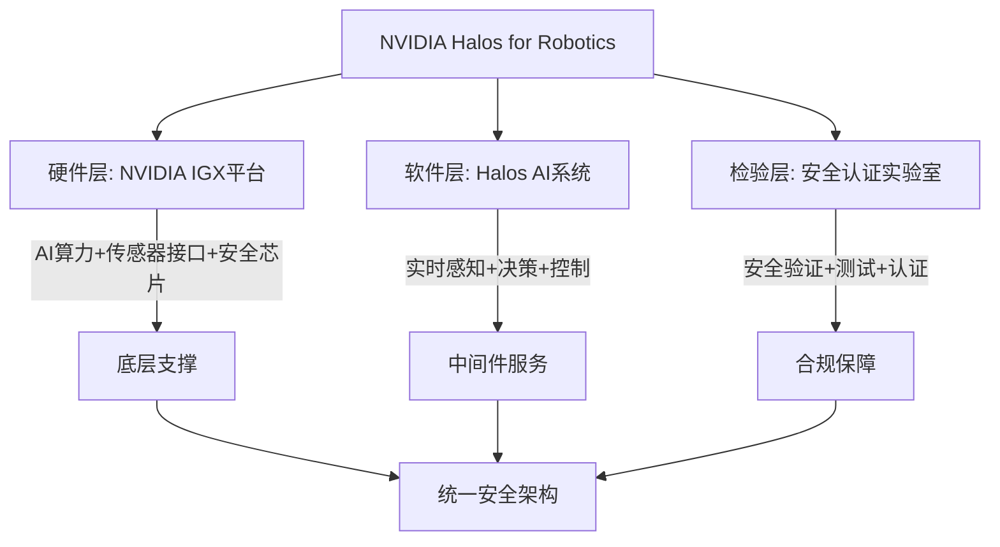
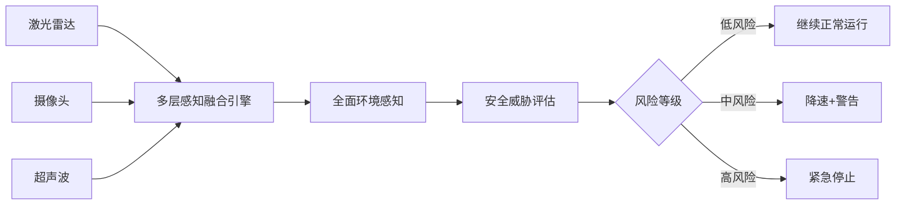
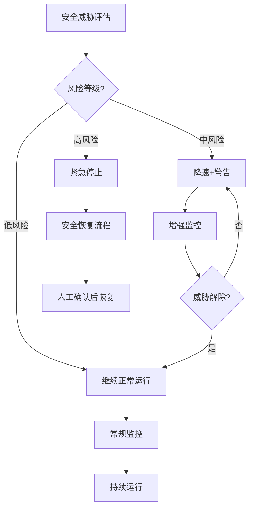
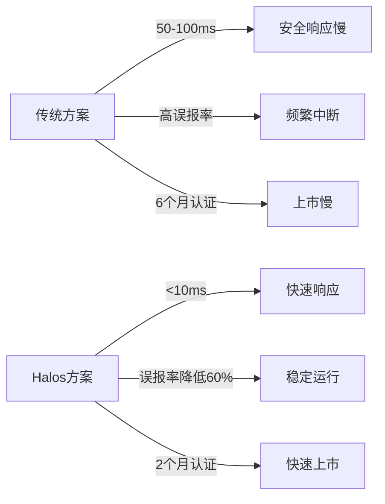
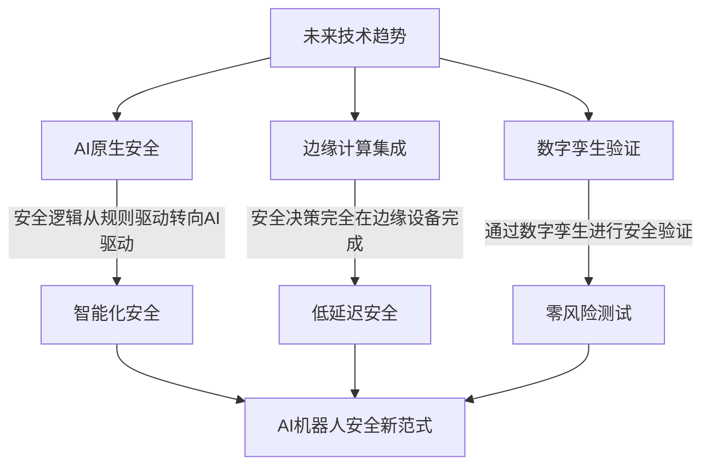
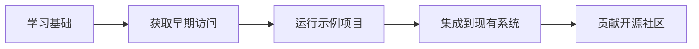

# 全栈AI安全架构：英伟达Halos for Robotics技术解析

**摘要：** 本文解析了NVIDIA于2026年6月23日发布的业界首个全栈机器人安全系统——**NVIDIA Halos for Robotics**。该系统旨在解决AI机器人从实验室走向工业应用时面临的安全挑战，通过统一的硬件、软件和检验层架构，提供实时、可认证的安全保障。

## 一、背景与挑战

AI机器人在工业环境中面临三大安全挑战：
1.  **硬件-软件-传感器碎片化**：安全组件分散，缺乏统一架构。
2.  **实时性要求**：物理世界安全决策需毫秒级响应。
3.  **认证复杂性**：需要覆盖硬件、软件、传感器、应用和认证流程的完整体系。



## 二、NVIDIA Halos for Robotics 系统架构

该系统是首个将AI算力与安全能力整合的全栈机器人安全系统。

### 2.1 三层架构



| 层级 | 组件 | 功能 |
|------|------|------|
| **硬件层** | NVIDIA IGX平台 | 提供AI算力、传感器接口、安全芯片 |
| **软件层** | Halos AI系统 | 实时感知、决策、控制的安全中间件 |
| **检验层** | Halos AI系统检验实验室 | 安全验证、测试、认证 |

### 2.2 核心技术特点

*   **统一安全架构**：将AI计算、系统软件、传感器数据、安全应用和机器人检验统一到同一套标准化架构，消除碎片化。
*   **实时安全决策**：基于NVIDIA IGX平台硬件加速，实现毫秒级响应。
*   **开源安全蓝图**：外部感知安全蓝图已在GitHub开放早期访问。

## 三、技术实现

### 3.1 多层感知融合

通过融合激光雷达、摄像头、超声波等多种传感器数据，实现全面的环境感知。



### 3.2 安全决策流程



### 3.3 实时性保障机制

| 机制 | 实现方式 | 响应时间 |
|------|---------|----------|
| **硬件加速** | NVIDIA IGX GPU | <1ms |
| **实时操作系统** | QNX Neutrino RTOS | <5ms |
| **安全MCU** | 独立安全控制器 | <10ms |
| **watchdog** | 硬件看门狗 | <1ms |

## 四、工业应用案例：Agility机器人

人形机器人企业 **Agility** 将率先采用该系统。

### 部署效果

| 指标 | 传统方案 | Halos方案 | 提升 |
|------|---------|----------|------|
| 安全响应时间 | 50-100ms | <10ms | **提升5-10倍** |
| 误报率 | 高 | 降低60%+ | **显著降低** |
| 认证周期 | 6个月 | 2个月 | **缩短67%** |



## 五、技术对比

### 5.1 传统安全方案 vs Halos方案

| 维度 | 传统方案 | Halos方案 |
|------|---------|----------|
| **架构** | 分布式、碎片化 | 统一全栈架构 |
| **实时性** | 50-100ms | <10ms |
| **灵活性** | 固定安全逻辑 | 可编程安全策略 |
| **认证** | 多次单独认证 | 统一认证框架 |
| **维护** | 多个供应商协调 | 单一供应商支持 |

### 5.2 与其他AI安全框架对比

| 框架 | 专注领域 | 硬件支持 | 实时性 | 开源程度 |
|------|---------|---------|--------|----------|
| **NVIDIA Halos** | 物理AI安全 | NVIDIA IGX | 高 | 部分开源 |
| **ROS2 Safety** | 机器人安全 | 通用硬件 | 中 | 完全开源 |
| **Isaac Sim** | 仿真验证 | NVIDIA GPU | 仿真环境 | 部分开源 |

## 六、开发者生态与早期访问

### 6.1 早期访问计划

*   **NVIDIA Halos Core**：面向NVIDIA IGX的开发者早期访问已开放。
*   **外部感知安全蓝图**：已在GitHub开放早期访问。
*   **安全测试工具包**：提供模拟环境和测试工具。

### 6.2 开发者资源

```bash
# 获取早期访问权限
git clone https://github.com/NVIDIA/Halos-Robotics.git
cd Halos-Robotics
./setup_early_access.sh

# 运行安全演示
python examples/safety_demo.py --mode=industrial
```

### 6.3 社区支持

*   **开发者论坛**：NVIDIA Developer Forums
*   **技术文档**：完整的API文档和集成指南
*   **认证培训**：NVIDIA官方认证课程

## 七、未来展望

### 7.1 技术发展趋势



### 7.2 当前挑战

| 挑战 | 影响 | 解决方案 |
|------|------|----------|
| **成本较高** | 限制中小企业采用 | 规模化生产降低成本 |
| **标准不统一** | 跨平台兼容性差 | 推动行业标准制定 |
| **人才短缺** | 实施和维护困难 | 培训认证体系建设 |

## 八、实践建议

### 8.1 企业采用策略

1.  **评估需求**：根据应用场景确定安全等级需求
2.  **试点项目**：从小规模试点开始，验证系统效果
3.  **团队培训**：培养内部安全专家团队
4.  **渐进部署**：逐步扩大部署范围

### 8.2 开发者学习路径



## 九、总结

NVIDIA Halos for Robotics代表了AI机器人安全的新范式，实现了从附加功能到核心架构、从硬件到全栈、从试点到规模化的转变，为AI机器人工业部署提供了坚实的技术基础。

---

**参考资料：**
1.  NVIDIA官网：NVIDIA Halos for Robotics发布说明
2.  Agility官网：工业人形机器人安全需求分析
3.  ISO 13849：机械安全-控制系统安全相关部分
4.  IEC 62443：工业自动化和控制系统安全

*本文由Succh与AI助手小米Claw共同创作*
*发布日期：2026-06-23*
*标签：#AI安全 #机器人 #NVIDIA #Halos #物理AI*