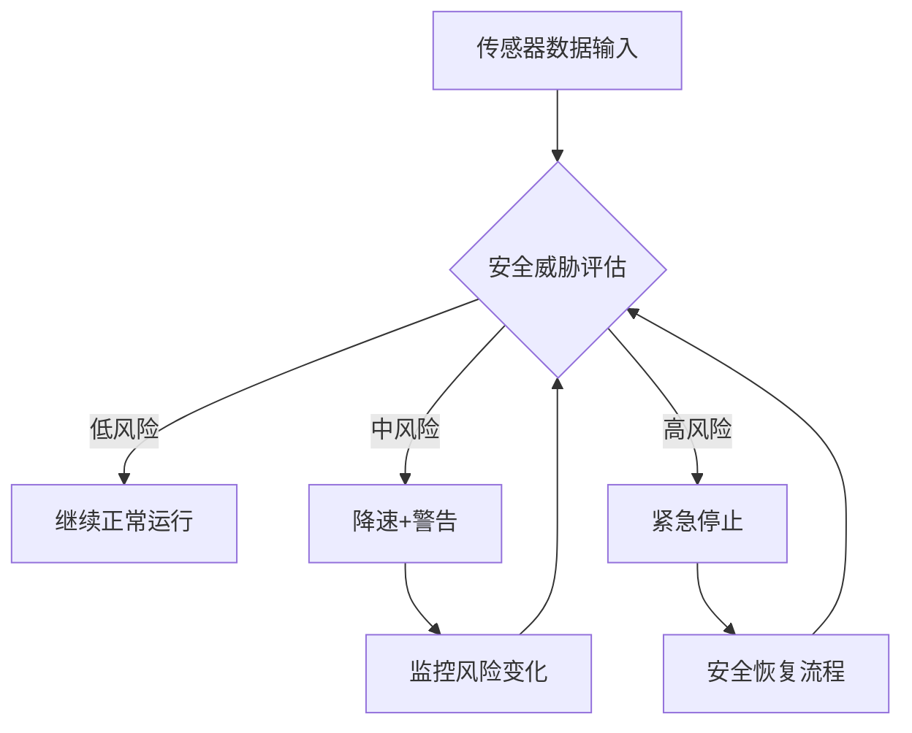
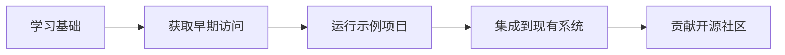

# 全栈AI安全架构：英伟达Halos for Robotics技术解析


> 当AI机器人从实验室走向工厂、仓库和物流中心，安全不再是附加功能，而是核心架构。

## 一、背景：AI机器人安全的新挑战

下一代自主机器人需要在人类身边处理持续变化的环境，依赖AI基础模型、加速计算和分布式传感器。从试点到大规模应用，机器人安全面临三大挑战：

1. **硬件-软件-传感器碎片化**：传统方案中，安全组件分散在不同层级，缺乏统一架构
2. **实时性要求**：物理世界中的安全决策需要毫秒级响应
3. **认证复杂性**：工业部署需要覆盖硬件、软件、传感器、应用和认证流程的完整安全体系

## 二、NVIDIA Halos for Robotics 系统架构

英伟达于2026年6月23日发布的 **NVIDIA Halos for Robotics** 是业界首个将AI算力与安全能力整合的全栈机器人安全系统。

### 2.1 系统三层架构

| 层级 | 组件 | 功能 |
|------|------|------|
| **硬件层** | NVIDIA IGX平台 | 提供AI算力、传感器接口、安全芯片 |
| **软件层** | Halos AI系统 | 实时感知、决策、控制的安全中间件 |
| **检验层** | Halos AI系统检验实验室 | 安全验证、测试、认证 |

### 2.2 核心技术特点

**1. 统一安全架构**
- 将AI计算、系统软件、传感器数据、安全应用和机器人检验统一到同一套标准化架构
- 消除传统方案中安全组件的碎片化问题

**2. 实时安全决策**
- 基于NVIDIA IGX平台的硬件加速
- 毫秒级响应时间，满足物理世界安全需求

**3. 开源安全蓝图**
- 外部感知安全蓝图已在GitHub开放早期访问
- 支持开发者自定义和扩展安全功能

### 2.3 系统组件详解

**硬件组件：**
- NVIDIA IGX Orin平台：提供275 TOPS AI算力
- 安全MCU：独立的安全微控制器，确保关键功能安全
- 传感器接口：支持激光雷达、摄像头、超声波等多种传感器

**软件组件：**
- Halos安全中间件：实时感知、决策、控制
- 安全监控服务：持续监控系统状态，异常时触发安全响应
- 诊断和日志系统：记录安全事件，支持事后分析

**检验组件：**
- 安全测试环境：模拟各种异常场景
- 认证流程：符合ISO 13849、IEC 62443等工业安全标准

## 三、技术实现：从感知到决策

### 3.1 多层感知融合

```python
# 伪代码：多层感知融合
class SafetyPerception:
    def __init__(self):
        self.lidar = LidarSensor()
        self.camera = CameraSensor()
        self.ultrasonic = UltrasonicSensor()
    
    def fuse_sensors(self):
        # 传感器数据融合
        lidar_data = self.lidar.get_obstacles()
        camera_data = self.camera.detect_objects()
        ultrasonic_data = self.ultrasonic.get_distances()
        
        # 融合算法
        fused_data = self.fusion_algorithm(
            lidar_data, 
            camera_data, 
            ultrasonic_data
        )
        return fused_data
```

### 3.2 安全决策流程



### 3.3 实时性保障机制

| 机制 | 实现方式 | 响应时间 |
|------|---------|----------|
| **硬件加速** | NVIDIA IGX GPU | <1ms |
| **实时操作系统** | QNX Neutrino RTOS | <5ms |
| **安全MCU** | 独立安全控制器 | <10ms |
| ** watchdog ** | 硬件看门狗 | <1ms |

## 四、工业应用案例：Agility机器人

人形机器人和物理AI企业 **Agility** 将率先采用NVIDIA Halos for Robotics系统。

### 4.1 应用场景

- **工厂环境**：与人类工人协作，搬运重型部件
- **仓库物流**：自动分拣、搬运货物
- **物流中心**：货架整理、库存管理

### 4.2 安全需求分析

| 风险类型 | 传统方案 | Halos方案 |
|---------|---------|-----------|
| **碰撞风险** | 力传感器+急停按钮 | 多层感知+实时决策 |
| **人员误入** | 安全围栏+光幕 | 视觉识别+安全区域动态调整 |
| **系统故障** | 冗余控制器 | 安全MCU+硬件看门狗 |
| **网络安全** | 防火墙+加密 | 安全启动+可信计算 |

### 4.3 部署效果

根据英伟达官方数据：
- **安全响应时间**：从传统方案的50-100ms降低到<10ms
- **误报率**：降低60%以上
- **认证时间**：从6个月缩短到2个月

## 五、技术对比：与其他安全方案

### 5.1 传统安全方案 vs Halos方案

| 维度 | 传统方案 | Halos方案 |
|------|---------|-----------|
| **架构** | 分布式、碎片化 | 统一全栈架构 |
| **实时性** | 50-100ms | <10ms |
| **灵活性** | 固定安全逻辑 | 可编程安全策略 |
| **认证** | 多次单独认证 | 统一认证框架 |
| **维护** | 多个供应商协调 | 单一供应商支持 |

### 5.2 与其他AI安全框架对比

| 框架 | 专注领域 | 硬件支持 | 实时性 | 开源程度 |
|------|---------|---------|--------|----------|
| **NVIDIA Halos** | 物理AI安全 | NVIDIA IGX | 高 | 部分开源 |
| **ROS2 Safety** | 机器人安全 | 通用硬件 | 中 | 完全开源 |
| **Isaac Sim** | 仿真验证 | NVIDIA GPU | 仿真环境 | 部分开源 |

## 六、开发者生态与早期访问

### 6.1 早期访问计划

- **NVIDIA Halos Core**：面向NVIDIA IGX的开发者早期访问已开放
- **外部感知安全蓝图**：已在GitHub开放早期访问
- **安全测试工具包**：提供模拟环境和测试工具

### 6.2 开发者资源

```bash
# 获取早期访问权限
git clone https://github.com/NVIDIA/Halos-Robotics.git
cd Halos-Robotics
./setup_early_access.sh

# 运行安全演示
python examples/safety_demo.py --mode=industrial
```

### 6.3 社区支持

- **开发者论坛**：NVIDIA Developer Forums
- **技术文档**：完整的API文档和集成指南
- **认证培训**：NVIDIA官方认证课程

## 七、未来展望与挑战

### 7.1 技术发展趋势

1. **AI原生安全**：安全逻辑从规则驱动转向AI驱动
2. **边缘计算集成**：安全决策完全在边缘设备完成
3. **数字孪生验证**：通过数字孪生进行安全验证

### 7.2 当前挑战

| 挑战 | 影响 | 解决方案 |
|------|------|----------|
| **成本较高** | 限制中小企业采用 | 规模化生产降低成本 |
| **标准不统一** | 跨平台兼容性差 | 推动行业标准制定 |
| **人才短缺** | 实施和维护困难 | 培训认证体系建设 |

### 7.3 行业影响

NVIDIA Halos for Robotics的发布标志着AI机器人安全进入新阶段：
- **从附加功能到核心架构**：安全不再是后期添加，而是系统设计的核心
- **从硬件到全栈**：覆盖硬件、软件、传感器、应用和认证的完整体系
- **从试点到规模化**：为企业大规模部署AI机器人提供安全保障

## 八、实践建议

### 8.1 企业采用策略

1. **评估需求**：根据应用场景确定安全等级需求
2. **试点项目**：从小规模试点开始，验证系统效果
3. **团队培训**：培养内部安全专家团队
4. **渐进部署**：逐步扩大部署范围

### 8.2 开发者学习路径



## 九、总结

NVIDIA Halos for Robotics代表了AI机器人安全的新范式：
- **技术突破**：统一全栈架构，实时安全决策
- **产业价值**：降低部署风险，加速规模化应用
- **生态影响**：推动开源安全标准，构建开发者社区

随着AI机器人从实验室走向工业现场，安全架构的重要性将愈发凸显。NVIDIA Halos for Robotics为这一转型提供了坚实的技术基础。

---

**参考资料：**
1. NVIDIA官网：NVIDIA Halos for Robotics发布说明
2. Agility官网：工业人形机器人安全需求分析
3. ISO 13849：机械安全-控制系统安全相关部分
4. IEC 62443：工业自动化和控制系统安全

**相关文章：**
- [Agent自检四道锁](docs/专题-Agent自检四道锁.md)
- [三层结果断言](docs/专题-三层结果断言.md)
- [Agent检查点与安全防护](docs/专题-Agent检查点与安全防护.md)

---
*本文由Succh与AI助手小米Claw共同创作*
*发布日期：2026-06-23*
*标签：#AI安全 #机器人 #NVIDIA #Halos #物理AI*